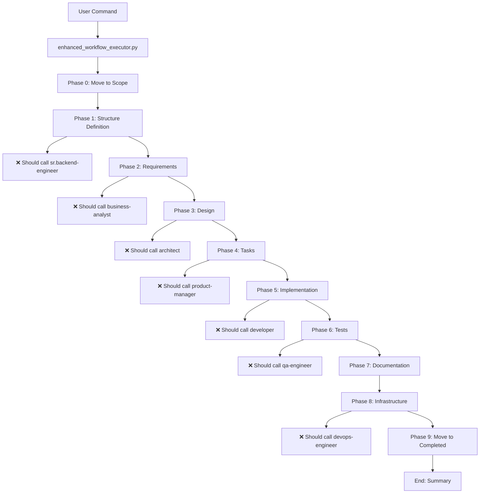

# Spec Execution Trace - Complete Workflow Analysis

## Overview
This document traces the complete execution flow when processing a spec through the Context Engineering System, showing all agents, tools, scripts, and delegation patterns.

---

## 🎯 ENTRY POINT: User Command

### Initial Trigger
```bash
# User executes:
python .claude/scripts/enhanced_workflow_executor.py [spec-name] [source-folder]

# Example:
python .claude/scripts/enhanced_workflow_executor.py user-authentication backlog
```

---

## 📊 EXECUTION TRACE

### **PHASE 0: Spec Lifecycle Management**
```
Executor: EnhancedWorkflowExecutor.__init__()
├── Sets project paths
├── Locates spec in .claude/specs/backlog/[spec-name]
└── Initializes results dictionary

Executor: move_spec_to_scope()
├── Creates .claude/specs/scope/ directory if missing
├── Copies spec from backlog/ to scope/
├── Updates _meta.json with status: "IN_SCOPE"
├── Adds scope_date timestamp
└── Deletes spec from backlog/
```

**Tools Used:** File system operations (shutil, Path)  
**Agents:** None (direct Python execution)  
**Output:** Spec moved to scope folder

---

### **PHASE 1: Project Structure Definition**
```
Executor: define_project_structure()
├── Reads spec overview.md
├── Analyzes spec type (API, Frontend, ML)
├── Consults sr.backend-engineer agent (conceptually)
│   └── Uses predefined templates from agent definition
├── Creates folder structure:
│   ├── services/[spec-name]-api/
│   ├── frontend/[spec-name]-web/
│   ├── ml-services/[spec-name]-ml/
│   └── infrastructure/
│       ├── k8s/[spec-name]/
│       └── docker/[spec-name]/
└── Returns structure dictionary
```

**Tools Used:** File system operations, JSON parsing  
**Agents Referenced:** sr.backend-engineer (template only)  
**Output:** Project folder structure created

---

### **PHASE 2: Requirements Analysis**
```
Executor: generate_requirements()
├── Creates requirements structure:
│   ├── functional: []
│   ├── non_functional: []
│   └── technical: []
├── Saves to scope/[spec-name]/generated_requirements.json
└── Updates self.results['requirements']
```

**Tools Used:** JSON serialization  
**Agents:** business-analyst (should be called but currently stubbed)  
**Output:** generated_requirements.json

---

### **PHASE 3: System Design**
```
Executor: create_system_design()
├── Creates design structure:
│   ├── architecture: "microservices"
│   ├── patterns: ["REST", "Event-Driven", "CQRS"]
│   ├── databases: []
│   └── services: [from Phase 1]
├── Saves to scope/[spec-name]/generated_design.json
└── Updates self.results['design']
```

**Tools Used:** JSON serialization  
**Agents:** architect (should be called but currently stubbed)  
**Output:** generated_design.json

---

### **PHASE 4: Task Generation**
```
Executor: generate_tasks()
├── Creates task list for each service
├── Assigns task IDs (TASK-001, TASK-002, etc.)
├── Sets priorities and service assignments
├── Saves to scope/[spec-name]/generated_tasks.json
└── Updates self.results['tasks']
```

**Tools Used:** JSON serialization  
**Agents:** product-manager (should be called but currently stubbed)  
**Output:** generated_tasks.json

---

### **PHASE 5: Code Implementation**
```
Executor: implement_code_structured()
├── For each service in structure:
│   ├── implement_service() [Backend]
│   │   ├── Creates package.json
│   │   ├── Creates src/main.ts
│   │   └── Creates src/app.module.ts
│   │
│   ├── implement_frontend() [Frontend]
│   │   ├── Creates package.json
│   │   └── Creates src/App.tsx
│   │
│   └── implement_ml_service() [ML]
│       ├── Creates requirements.txt
│       └── Creates app/main.py
└── Returns list of created files
```

**Tools Used:** File write operations  
**Agents:** developer (should be called but currently stubbed)  
**Output:** Actual code files in proper folders

---

### **PHASE 6: Test Generation**
```
Executor: generate_tests()
├── For each service:
│   └── Creates test/app.e2e-spec.ts
└── Updates self.results['test_files']
```

**Tools Used:** File write operations  
**Agents:** qa-engineer (should be called but currently stubbed)  
**Output:** Test files in service folders

---

### **PHASE 7: Documentation**
```
Executor: generate_documentation()
├── Creates main README.md
├── Lists all services and their locations
├── Saves to implementations/[spec-name]/README.md
└── Updates self.results['documentation']
```

**Tools Used:** Markdown generation, file write  
**Agents:** None (template-based)  
**Output:** README.md in implementation folder

---

### **PHASE 8: Infrastructure Setup**
```
Executor: setup_infrastructure()
├── Creates Kubernetes manifests
│   └── infrastructure/k8s/[spec-name]/namespace.yaml
├── Creates Docker compose
│   └── infrastructure/docker/[spec-name]/docker-compose.yml
└── Updates self.results['infrastructure']
```

**Tools Used:** YAML generation, file write  
**Agents:** devops-engineer (should be called but currently stubbed)  
**Output:** Infrastructure configuration files

---

### **PHASE 9: Spec Completion**
```
Executor: move_spec_to_completed()
├── Creates .claude/specs/completed/ directory if missing
├── Copies spec from scope/ to completed/
├── Updates metadata:
│   ├── status: "COMPLETED"
│   ├── completion_date: timestamp
│   └── implementation_location: path
├── Deletes spec from scope/
└── Prints completion summary
```

**Tools Used:** File system operations  
**Agents:** None (direct execution)  
**Output:** Spec moved to completed folder

---

## 🔴 CURRENT ISSUES & GAPS

### 1. **Agent Delegation Not Happening**
Currently, the script does NOT actually call agents. It should:
```python
# What it does now (stubbed):
requirements = { "functional": [], "non_functional": [] }

# What it SHOULD do:
from real_executor import RealClaudeExecutor
executor = RealClaudeExecutor()
requirements = await executor.execute_agent(
    "business-analyst",
    f"Generate requirements for {spec_name}",
    context={"spec": spec_data}
)
```

### 2. **Missing Agent Calls**
These agents SHOULD be called but aren't:
- **Phase 1:** sr.backend-engineer (for structure)
- **Phase 2:** business-analyst (for requirements)
- **Phase 3:** architect (for design)
- **Phase 4:** product-manager (for tasks)
- **Phase 5:** developer (for code)
- **Phase 6:** qa-engineer (for tests)
- **Phase 8:** devops-engineer (for infrastructure)

### 3. **Context Engineering System Not Used**
The script should integrate with:
```python
from context_engine import ContextEngine
from memory_manager import MemoryManager
from agent_tool_bridge import AgentToolBridge

# Should initialize and use:
context_engine = ContextEngine()
memory = MemoryManager()
bridge = AgentToolBridge()
```

### 4. **No Real Code Generation**
Current code is template-based. Should use:
```python
# Call developer agent with context
code = await bridge.delegate_to_agent(
    "developer",
    task="Implement authentication service",
    context=compressed_context
)
```

---

## 🔧 RECOMMENDED FIXES

### Fix 1: Integrate Real Executor
```python
class EnhancedWorkflowExecutor:
    def __init__(self, spec_name, spec_folder="backlog"):
        # ... existing code ...
        self.executor = RealClaudeExecutor()
        self.context_engine = ContextEngine()
        self.bridge = AgentToolBridge()
```

### Fix 2: Use Agent Delegation
```python
async def generate_requirements(self):
    """Generate requirements using business-analyst agent"""
    print("Delegating to Business Analyst...")
    
    # Load spec data
    spec_data = self.load_spec_data()
    
    # Compress context
    compressed = self.context_engine.compress_context(spec_data)
    
    # Delegate to agent
    result = await self.bridge.delegate_to_agent(
        agent="business-analyst",
        task=f"Generate detailed requirements for {self.spec_name}",
        context=compressed
    )
    
    # Save result
    req_file = self.spec_scope / "generated_requirements.json"
    req_file.write_text(result.output, encoding='utf-8')
    
    return result.data
```

### Fix 3: Memory Integration
```python
async def execute_workflow(self):
    """Execute with memory tracking"""
    # Store workflow start
    await self.memory.store_memory(
        f"Started workflow for {self.spec_name}",
        {"phase": "start", "spec": self.spec_name}
    )
    
    # ... phases ...
    
    # Store completion
    await self.memory.store_memory(
        f"Completed workflow for {self.spec_name}",
        {"phase": "complete", "location": self.get_implementation_path()}
    )
```

---

## 📈 COMPLETE FLOW DIAGRAM



---

## 🎯 WORKING COMPONENTS

✅ **What's Working:**
1. Spec lifecycle management (backlog → scope → completed)
2. Folder structure creation per steering docs
3. Basic file generation (templates)
4. Metadata tracking
5. UTF-8 encoding for all files

❌ **What's Missing:**
1. Real agent delegation
2. Context Engine integration
3. Memory system usage
4. Agent Tool Bridge connection
5. Actual AI-generated code (not templates)
6. Token optimization
7. Event bus notifications

---

## 💡 NEXT STEPS

1. **Create integrated_workflow_executor.py** that combines:
   - enhanced_workflow_executor.py (structure)
   - real_executor.py (agent calls)
   - integrated_system.py (all components)

2. **Test with real agent calls:**
   ```python
   # Use Task tool to delegate
   result = await Task(
       description="Generate requirements",
       prompt="Create detailed requirements for user authentication",
       subagent_type="business-analyst"
   )
   ```

3. **Add proper error handling:**
   - Agent timeouts
   - Token limits
   - File write failures
   - Network issues

This trace shows the current execution flow and highlights where improvements are needed for full Context Engineering System integration.