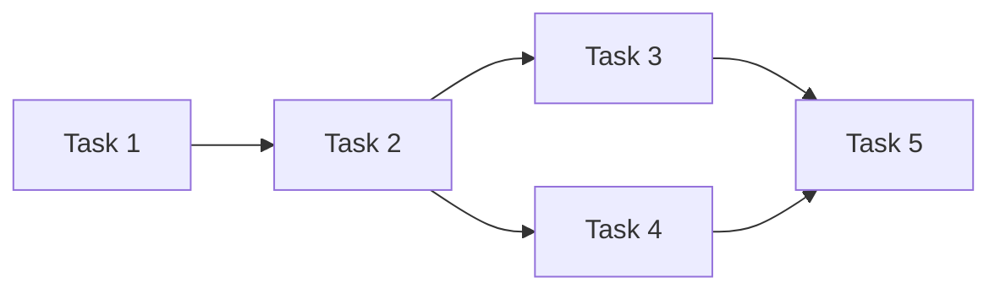

# Development Roadmap Template

## Feature Overview
- **Name**: [Feature Name]
- **Total Duration**: [Estimated timeline]
- **Team Size**: [Required team]

## Phase Breakdown

### Phase 1: Foundation [Week 1-2]
**Goal**: [What this phase achieves]

**Tasks**:
1. [Task 1]
2. [Task 2]
3. [Task 3]

**Deliverables**:
- [Deliverable 1]
- [Deliverable 2]

### Phase 2: Core Implementation [Week 3-4]
**Goal**: [What this phase achieves]

**Tasks**:
1. [Task 1]
2. [Task 2]
3. [Task 3]

**Deliverables**:
- [Deliverable 1]
- [Deliverable 2]

### Phase 3: Integration & Testing [Week 5]
**Goal**: [What this phase achieves]

**Tasks**:
1. [Task 1]
2. [Task 2]
3. [Task 3]

**Deliverables**:
- [Deliverable 1]
- [Deliverable 2]

### Phase 4: Polish & Launch [Week 6]
**Goal**: [What this phase achieves]

**Tasks**:
1. [Task 1]
2. [Task 2]
3. [Task 3]

**Deliverables**:
- [Deliverable 1]
- [Deliverable 2]

## Task Dependencies

## Critical Path
[Sequence of tasks that determine minimum timeline]

## Risk Mitigation
1. **Risk**: [Description] | **Mitigation**: [Strategy]
2. **Risk**: [Description] | **Mitigation**: [Strategy]

## Success Criteria
- [ ] [Criterion 1]
- [ ] [Criterion 2]
- [ ] [Criterion 3]

## Go/No-Go Decision Points
1. **After Phase 1**: [Decision criteria]
2. **After Phase 2**: [Decision criteria]

## Launch Plan
- **Soft Launch**: [Strategy]
- **Full Launch**: [Strategy]
- **Rollback Plan**: [If needed]