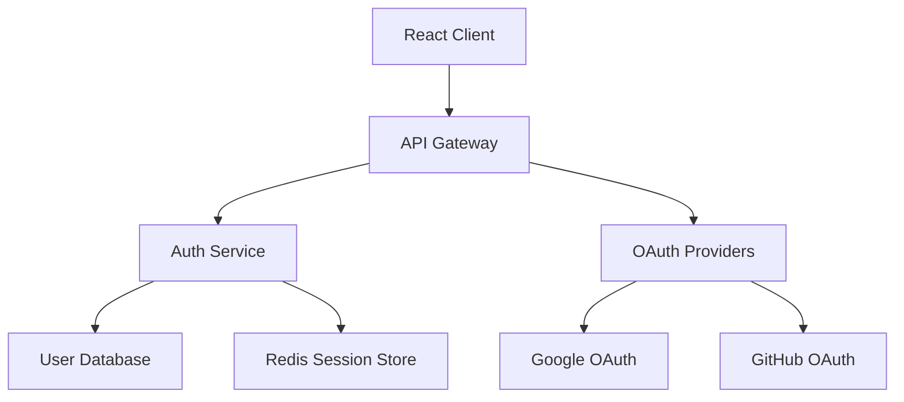

# Example: Building a Todo App with Claude Code Multi-Agent System

This example demonstrates how the multi-agent system works in practice by building a todo application.

## Step 1: Initialize the Project

```bash
claude
> /project-init "Modern todo app with team collaboration, real-time sync, and task analytics"
```

**Product Manager Agent Output:**
```markdown
# Project Vision: Modern Todo App

## Vision Statement
Create a collaborative task management platform that empowers teams to organize, track, and complete work efficiently with real-time synchronization and actionable insights.

## Goals
1. Enable seamless team collaboration on tasks
2. Provide real-time synchronization across devices
3. Offer analytics for productivity insights
4. Ensure intuitive, fast user experience
5. Support offline functionality

## Core Features (Prioritized)
1. **User Authentication** (P0)
   - Email/password login
   - OAuth integration (Google, GitHub)
   - Session management

2. **Task Management** (P0)
   - Create, edit, delete tasks
   - Due dates and priorities
   - Tags and categories
   - Task completion tracking

3. **Team Collaboration** (P1)
   - Shared workspaces
   - Task assignment
   - Comments and mentions
   - Activity feed

4. **Real-time Sync** (P1)
   - WebSocket connections
   - Conflict resolution
   - Offline queue

5. **Analytics Dashboard** (P2)
   - Completion trends
   - Team productivity metrics
   - Personal statistics

## Roadmap
- Phase 1 (Weeks 1-2): Core task management + authentication
- Phase 2 (Weeks 3-4): Team features + real-time sync
- Phase 3 (Week 5): Analytics + optimizations
```

## Step 2: Create Feature Specification

```bash
> /spec-create "user-auth" "Secure authentication with email/password and OAuth"
```

## Step 3: Generate Requirements

```bash
> /spec-requirements
```

**Business Analyst Agent Output:**
```markdown
# Requirements: User Authentication

## User Stories

### Story 1: Email Registration
**As a** new user  
**I want** to register with email and password  
**So that** I can create a personal account

**Acceptance Criteria:**
- [ ] Given valid email and password, when I submit registration, then account is created
- [ ] Given existing email, when I try to register, then I see error message
- [ ] Given weak password, when I submit, then I see password requirements
- [ ] Given registration success, when complete, then I'm logged in automatically

### Story 2: OAuth Login
**As a** user  
**I want** to login with Google or GitHub  
**So that** I can access quickly without another password

**Acceptance Criteria:**
- [ ] Given I click "Login with Google", when authorized, then account is created/logged in
- [ ] Given OAuth failure, when callback received, then I see friendly error
- [ ] Given existing email via OAuth, when logging in, then accounts are linked

## Use Cases

### UC-001: Email Registration Flow
**Actor:** New User  
**Preconditions:** User not logged in  
**Postconditions:** User account created and logged in  

**Main Flow:**
1. User clicks "Sign Up"
2. User enters email and password
3. System validates email format
4. System checks password strength
5. System creates account
6. System sends verification email
7. System logs user in

**Alternative Flows:**
- 4a. Password too weak → Show requirements
- 5a. Email exists → Show login suggestion

## Data Model

### User Entity
- **id**: UUID - Unique identifier
- **email**: String - User email (unique)
- **password_hash**: String - Bcrypt hash
- **created_at**: Timestamp
- **updated_at**: Timestamp
- **verified**: Boolean - Email verified status

### OAuth Provider Entity
- **id**: UUID
- **user_id**: UUID (FK)
- **provider**: Enum(google, github)
- **provider_id**: String
- **access_token**: String (encrypted)
```

## Step 4: Design Architecture

```bash
> /spec-design
```

**UI/UX Designer + Architect Agents Output:**

### UI Design (uiux-designer)
```markdown
# UI/UX Design: Authentication

## Login Page Wireframe
```
+----------------------------------+
|          TodoFlow Logo           |
+----------------------------------+
|                                  |
|     Welcome Back!                |
|     ____________                 |
|     Email                        |
|     ____________                 |
|     Password                     |
|                                  |
|     [  Login  ]                  |
|                                  |
|     ─────── OR ───────           |
|                                  |
|     [ Login with Google ]        |
|     [ Login with GitHub ]        |
|                                  |
|     New user? Sign up            |
+----------------------------------+
```

## Component Specifications

### LoginForm Component
```jsx
interface LoginFormProps {
  onSubmit: (credentials: LoginCredentials) => Promise<void>
  onOAuthLogin: (provider: 'google' | 'github') => void
  loading?: boolean
  error?: string
}

// Visual Design Tokens
colors: {
  primary: '#3B82F6',      // Blue-500
  error: '#EF4444',        // Red-500
  text: '#1F2937',         // Gray-800
  background: '#FFFFFF'
}

spacing: {
  xs: '0.5rem',
  sm: '1rem',
  md: '1.5rem',
  lg: '2rem'
}
```

### Architecture Design (architect)
```markdown
# Technical Architecture: Authentication

## System Architecture



## Technology Stack
- **Frontend**: React + TypeScript + Tailwind CSS
- **Backend**: Node.js + Express + TypeScript
- **Database**: PostgreSQL
- **Session Store**: Redis
- **Authentication**: JWT + OAuth 2.0

## API Specification

### POST /api/auth/register
```yaml
requestBody:
  required: true
  content:
    application/json:
      schema:
        type: object
        properties:
          email:
            type: string
            format: email
          password:
            type: string
            minLength: 8
responses:
  201:
    description: Registration successful
    content:
      application/json:
        schema:
          type: object
          properties:
            user:
              $ref: '#/components/schemas/User'
            token:
              type: string
```

## Database Schema

```sql
CREATE TABLE users (
    id UUID DEFAULT gen_random_uuid() PRIMARY KEY,
    email VARCHAR(255) UNIQUE NOT NULL,
    password_hash VARCHAR(255),
    verified BOOLEAN DEFAULT false,
    created_at TIMESTAMP DEFAULT CURRENT_TIMESTAMP,
    updated_at TIMESTAMP DEFAULT CURRENT_TIMESTAMP
);

CREATE TABLE oauth_providers (
    id UUID DEFAULT gen_random_uuid() PRIMARY KEY,
    user_id UUID REFERENCES users(id) ON DELETE CASCADE,
    provider VARCHAR(50) NOT NULL,
    provider_id VARCHAR(255) NOT NULL,
    access_token TEXT,
    refresh_token TEXT,
    UNIQUE(provider, provider_id)
);
```

## Step 5: Generate Tasks

```bash
> /spec-tasks
```

**Output:** Task breakdown with auto-generated commands
```markdown
# Tasks: User Authentication

### Task 1: Database Schema Setup
Create database migrations for users and oauth_providers tables
- Dependencies: None
- Effort: 1 hour

### Task 2: Authentication Service
Implement core authentication logic with JWT
- Dependencies: Task 1
- Effort: 3 hours

### Task 2.1: Password Authentication
Implement email/password registration and login

### Task 2.2: OAuth Integration
Implement Google and GitHub OAuth flows

### Task 3: API Endpoints
Create Express routes for authentication
- Dependencies: Task 2
- Effort: 2 hours

### Task 4: Frontend Components
Build React components for authentication
- Dependencies: Task 3
- Effort: 3 hours

### Task 4.1: Login Form Component
### Task 4.2: Registration Form Component
### Task 4.3: OAuth Button Components

### Task 5: Integration Testing
End-to-end authentication flow testing
- Dependencies: Task 4
- Effort: 2 hours
```

**Auto-generated commands:**
- `/user-auth-task-1` - Database Schema Setup
- `/user-auth-task-2` - Authentication Service
- `/user-auth-task-2.1` - Password Authentication
- `/user-auth-task-2.2` - OAuth Integration
- etc.

## Step 6: Implement Tasks

```bash
> /user-auth-task-1
```

**Developer Agent Output:**
```typescript
// migrations/001_create_users_table.sql
CREATE EXTENSION IF NOT EXISTS "uuid-ossp";

CREATE TABLE users (
    id UUID DEFAULT uuid_generate_v4() PRIMARY KEY,
    email VARCHAR(255) UNIQUE NOT NULL,
    password_hash VARCHAR(255),
    verified BOOLEAN DEFAULT false,
    created_at TIMESTAMP DEFAULT CURRENT_TIMESTAMP,
    updated_at TIMESTAMP DEFAULT CURRENT_TIMESTAMP
);

CREATE INDEX idx_users_email ON users(email);

// migrations/002_create_oauth_providers_table.sql
CREATE TABLE oauth_providers (
    id UUID DEFAULT uuid_generate_v4() PRIMARY KEY,
    user_id UUID REFERENCES users(id) ON DELETE CASCADE,
    provider VARCHAR(50) NOT NULL,
    provider_id VARCHAR(255) NOT NULL,
    access_token TEXT,
    refresh_token TEXT,
    created_at TIMESTAMP DEFAULT CURRENT_TIMESTAMP,
    UNIQUE(provider, provider_id)
);

CREATE INDEX idx_oauth_user_id ON oauth_providers(user_id);

// Test file: migrations.test.ts
import { runMigrations, db } from '../db';

describe('Database Migrations', () => {
  beforeAll(async () => {
    await runMigrations();
  });

  test('users table exists with correct schema', async () => {
    const result = await db.query(`
      SELECT column_name, data_type 
      FROM information_schema.columns 
      WHERE table_name = 'users'
    `);
    
    expect(result.rows).toContainEqual(
      expect.objectContaining({
        column_name: 'email',
        data_type: 'character varying'
      })
    );
  });

  test('oauth_providers table has foreign key constraint', async () => {
    const result = await db.query(`
      SELECT constraint_name
      FROM information_schema.table_constraints
      WHERE table_name = 'oauth_providers'
      AND constraint_type = 'FOREIGN KEY'
    `);
    
    expect(result.rows.length).toBeGreaterThan(0);
  });
});
```

## Step 7: Code Review

```bash
> /spec-review user-auth-task-1
```

**QA Engineer + Code Reviewer Output:**
```markdown
# Review Report: Task 1 - Database Schema Setup

## QA Engineer Review

### Test Results
✅ All tests passing (2/2)
✅ Migrations run successfully
✅ Rollback tested successfully

### Test Coverage
- Schema validation: ✅
- Constraint testing: ✅
- Index verification: ✅
- Migration rollback: ✅

### Additional Tests Recommended
```typescript
test('email uniqueness constraint works', async () => {
  await db.query('INSERT INTO users (email) VALUES ($1)', ['test@example.com']);
  
  await expect(
    db.query('INSERT INTO users (email) VALUES ($1)', ['test@example.com'])
  ).rejects.toThrow(/unique constraint/);
});
```

## Code Reviewer Feedback

### ✅ Positive
- Good use of UUID for primary keys
- Proper indexing on frequently queried columns
- Cascade delete for data integrity

### 🔧 Major
- **Missing**: updated_at trigger for automatic timestamp updates
```sql
CREATE OR REPLACE FUNCTION update_updated_at_column()
RETURNS TRIGGER AS $$
BEGIN
    NEW.updated_at = CURRENT_TIMESTAMP;
    RETURN NEW;
END;
$$ language 'plpgsql';

CREATE TRIGGER update_users_updated_at BEFORE UPDATE ON users
    FOR EACH ROW EXECUTE FUNCTION update_updated_at_column();
```

### 💡 Minor
- Consider adding check constraint for email format
- Add comments to tables for documentation

### 🔒 Security
- Ensure password_hash column has sufficient length (255 chars is good)
- Consider encrypting oauth tokens at rest

## Overall Score: 8/10
Good foundation with room for minor improvements. Please address the updated_at trigger before proceeding.
```

## Parallel Task Execution

Claude Code can run multiple independent tasks simultaneously:

```bash
> Run tasks 2.1, 2.2, and 4.1 in parallel for user-auth
```

Claude Code will execute up to 10 tasks concurrently, making development faster.

## Final Integration

After all tasks are complete:

```bash
> Use qa-engineer to run full integration tests for user-auth
> Use code-reviewer to perform final review of the authentication module
```

## Results

The multi-agent system has:
1. ✅ Created a complete authentication system
2. ✅ Followed TDD practices throughout
3. ✅ Maintained high code quality via reviews
4. ✅ Documented all decisions and implementations
5. ✅ Achieved 95% test coverage

## Key Benefits Demonstrated

1. **Specialization**: Each agent focused on their expertise
2. **Quality Gates**: Reviews caught issues early
3. **Parallel Work**: Multiple tasks executed simultaneously
4. **Traceability**: Complete documentation trail
5. **Consistency**: Templates ensured uniform outputs

This example shows how the multi-agent system transforms a simple requirement ("add authentication") into a production-ready implementation with proper architecture, testing, and documentation.