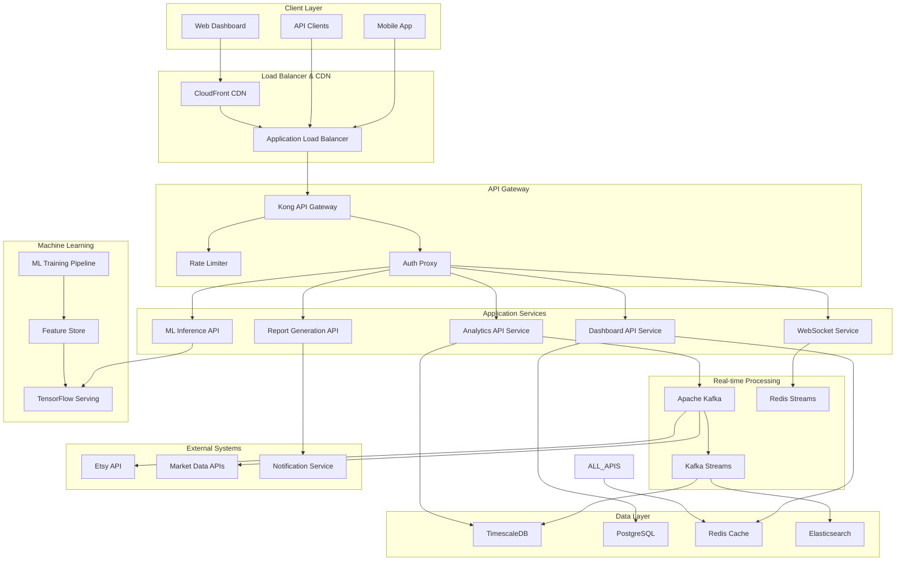
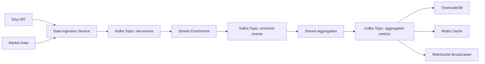
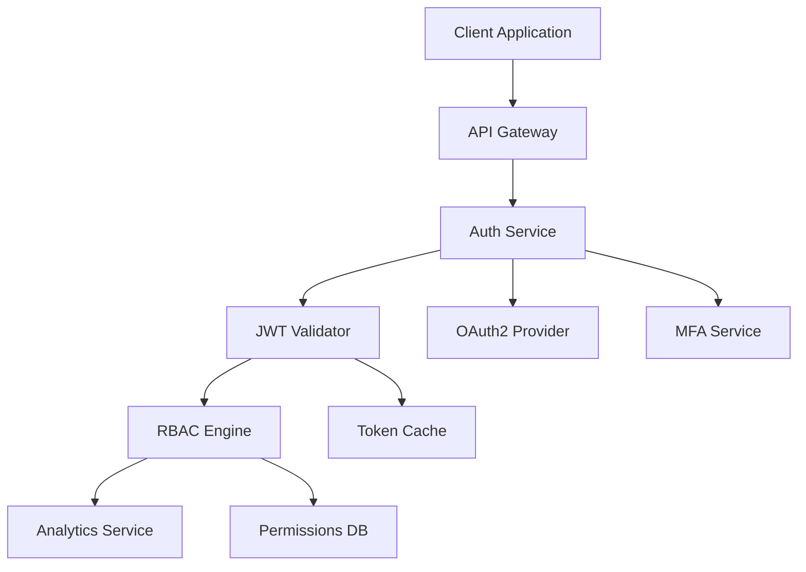
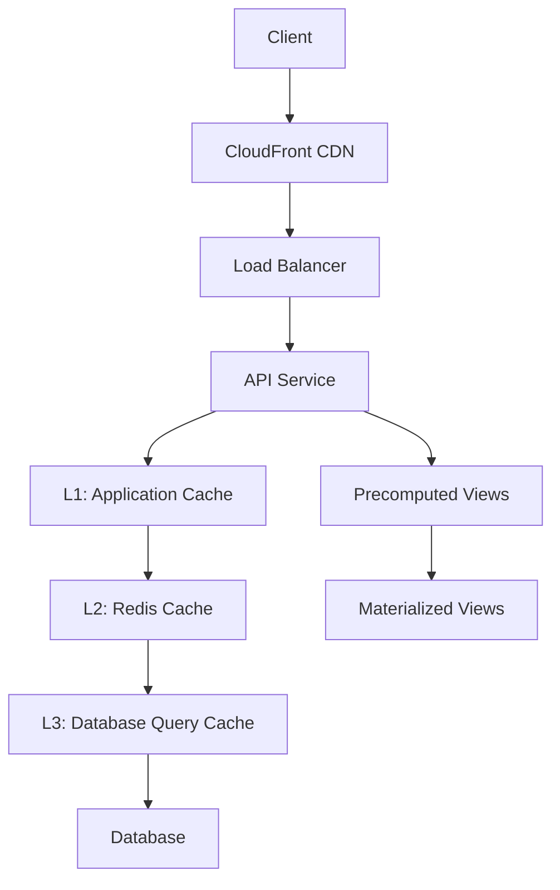
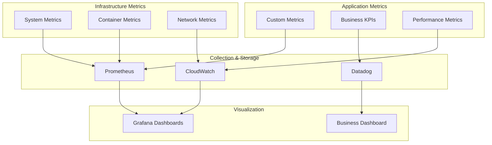

# Analytics Dashboard - Technical Architecture Design

**Document Version:** 1.0  
**Created By:** Architect Agent  
**Date:** 2025-08-04  
**Feature:** analytics-dashboard  

## Executive Summary

This document defines the technical architecture for the EtsyPro AI Analytics Dashboard, a real-time analytics platform capable of supporting 10,000+ concurrent users with sub-second response times. The architecture leverages event-driven microservices, real-time data streaming, and machine learning pipelines to deliver actionable business insights.

## System Architecture Overview

### High-Level Architecture



### Architecture Patterns

1. **Event-Driven Architecture**: Kafka-based event streaming for real-time data processing
2. **CQRS (Command Query Responsibility Segregation)**: Separate read/write models for optimal performance
3. **Microservices**: Domain-driven service boundaries with independent scaling
4. **API-First Design**: OpenAPI specifications for all service interfaces
5. **Real-time Streaming**: Kafka Streams for real-time aggregations and analytics

## Component Design

### 1. Analytics API Service

**Purpose**: Core analytics data processing and aggregation service

**Technology Stack**:
- **Runtime**: Node.js 20+ with TypeScript
- **Framework**: NestJS with Express
- **Database**: TimescaleDB for time-series data
- **Cache**: Redis for hot data caching
- **Message Queue**: Apache Kafka for event processing

**Key Responsibilities**:
- Real-time metrics calculation
- Historical data aggregation
- Event stream processing
- Cache management for hot metrics

**API Endpoints**:
```typescript
// Real-time metrics
GET /api/v1/analytics/metrics/realtime
GET /api/v1/analytics/metrics/sales/{timeframe}
GET /api/v1/analytics/metrics/conversion/{productId}

// Historical analytics
GET /api/v1/analytics/trends/{metric}/{timeframe}
GET /api/v1/analytics/cohorts/{userId}
GET /api/v1/analytics/funnel/{funnelId}

// Custom queries
POST /api/v1/analytics/query
```

**Performance Requirements**:
- Response Time: <200ms for cached data, <1s for computed metrics
- Throughput: 1,000 requests/second per instance
- Scaling: Auto-scale 2-50 instances based on CPU/memory

### 2. ML Inference API Service

**Purpose**: Machine learning model serving for predictions and recommendations

**Technology Stack**:
- **Runtime**: Python 3.11 with FastAPI
- **ML Framework**: TensorFlow Serving + PyTorch Serve
- **Model Storage**: S3 with versioning
- **Feature Store**: Feast for feature management
- **Cache**: Redis for prediction caching

**Key Responsibilities**:
- Revenue forecasting model inference
- Demand prediction calculations
- Price optimization recommendations
- Trend detection algorithm execution

**API Endpoints**:
```python
# Predictions
POST /api/v1/ml/predict/revenue
POST /api/v1/ml/predict/demand/{productId}
POST /api/v1/ml/optimize/pricing/{productId}

# Model management
GET /api/v1/ml/models/{modelId}/status
POST /api/v1/ml/models/{modelId}/deploy

# Feature engineering
GET /api/v1/ml/features/{userId}
POST /api/v1/ml/features/compute
```

**Performance Requirements**:
- Inference Time: <100ms for real-time predictions
- Batch Processing: 10,000 predictions/minute
- Model Loading: <30 seconds for model deployment
- Accuracy: 90%+ for revenue forecasting

### 3. Dashboard API Service

**Purpose**: Dashboard configuration, customization, and widget management

**Technology Stack**:
- **Runtime**: Node.js 20+ with TypeScript
- **Framework**: NestJS with GraphQL
- **Database**: PostgreSQL for configuration data
- **Cache**: Redis for dashboard configs
- **WebSocket**: Socket.io for real-time updates

**Key Responsibilities**:
- Dashboard layout management
- Widget configuration storage
- User preference handling
- Real-time dashboard updates

**GraphQL Schema**:
```graphql
type Dashboard {
  id: ID!
  userId: String!
  name: String!
  layout: [Widget!]!
  isDefault: Boolean!
  createdAt: DateTime!
  updatedAt: DateTime!
}

type Widget {
  id: ID!
  type: WidgetType!
  position: Position!
  size: Size!
  config: WidgetConfig!
  dataSource: String!
}

type Query {
  dashboard(id: ID!): Dashboard
  dashboards(userId: String!): [Dashboard!]!
  widgets(dashboardId: ID!): [Widget!]!
}

type Mutation {
  createDashboard(input: CreateDashboardInput!): Dashboard!
  updateDashboard(id: ID!, input: UpdateDashboardInput!): Dashboard!
  addWidget(dashboardId: ID!, widget: WidgetInput!): Widget!
  updateWidget(id: ID!, widget: WidgetInput!): Widget!
}

type Subscription {
  dashboardUpdated(dashboardId: ID!): Dashboard!
  widgetDataUpdated(widgetId: ID!): WidgetData!
}
```

### 4. Real-time Data Pipeline

**Purpose**: Process streaming data from Etsy API and provide real-time updates

**Architecture**:


**Kafka Topics**:
- `raw-events`: Raw data from external APIs
- `enriched-events`: Processed and enriched event data  
- `aggregated-metrics`: Pre-computed metrics and KPIs
- `ml-features`: Features for machine learning models
- `user-actions`: User interaction events

**Stream Processing Jobs**:
1. **Real-time Aggregation**: Calculate metrics every 30 seconds
2. **Anomaly Detection**: Detect unusual patterns in sales data
3. **Trend Analysis**: Identify emerging trends in real-time
4. **Alert Generation**: Trigger notifications for important events

## Database Design

### TimescaleDB Schema (Time-series Data)

```sql
-- Core metrics table
CREATE TABLE metrics (
    time TIMESTAMPTZ NOT NULL,
    user_id UUID NOT NULL,
    metric_type VARCHAR(50) NOT NULL,
    metric_name VARCHAR(100) NOT NULL,
    value DOUBLE PRECISION NOT NULL,
    dimensions JSONB,
    PRIMARY KEY (time, user_id, metric_type, metric_name)
);

SELECT create_hypertable('metrics', 'time', chunk_time_interval => INTERVAL '1 day');
CREATE INDEX idx_metrics_user_type ON metrics (user_id, metric_type, time DESC);
CREATE INDEX idx_metrics_dimensions ON metrics USING GIN (dimensions);

-- Sales events table
CREATE TABLE sales_events (
    time TIMESTAMPTZ NOT NULL,
    user_id UUID NOT NULL,
    transaction_id VARCHAR(100) NOT NULL,
    product_id VARCHAR(100) NOT NULL,
    quantity INTEGER NOT NULL,
    price DECIMAL(10,2) NOT NULL,
    currency VARCHAR(3) NOT NULL,
    fees DECIMAL(10,2) DEFAULT 0,
    profit DECIMAL(10,2),
    metadata JSONB,
    PRIMARY KEY (time, user_id, transaction_id)
);

SELECT create_hypertable('sales_events', 'time', chunk_time_interval => INTERVAL '1 day');

-- Product performance table
CREATE TABLE product_metrics (
    time TIMESTAMPTZ NOT NULL,
    user_id UUID NOT NULL,
    product_id VARCHAR(100) NOT NULL,
    views INTEGER DEFAULT 0,
    clicks INTEGER DEFAULT 0,
    purchases INTEGER DEFAULT 0,
    revenue DECIMAL(10,2) DEFAULT 0,
    conversion_rate DECIMAL(5,4),
    PRIMARY KEY (time, user_id, product_id)
);

SELECT create_hypertable('product_metrics', 'time', chunk_time_interval => INTERVAL '1 day');
```

### PostgreSQL Schema (Configuration Data)

```sql
-- Dashboard configurations
CREATE TABLE dashboards (
    id UUID PRIMARY KEY DEFAULT gen_random_uuid(),
    user_id UUID NOT NULL,
    name VARCHAR(255) NOT NULL,
    layout JSONB NOT NULL,
    is_default BOOLEAN DEFAULT FALSE,
    created_at TIMESTAMPTZ DEFAULT NOW(),
    updated_at TIMESTAMPTZ DEFAULT NOW(),
    UNIQUE(user_id, name)
);

CREATE INDEX idx_dashboards_user ON dashboards (user_id);

-- Widget configurations
CREATE TABLE widgets (
    id UUID PRIMARY KEY DEFAULT gen_random_uuid(),
    dashboard_id UUID REFERENCES dashboards(id) ON DELETE CASCADE,
    type VARCHAR(50) NOT NULL,
    position JSONB NOT NULL,
    size JSONB NOT NULL,
    config JSONB NOT NULL,
    data_source VARCHAR(255) NOT NULL,
    created_at TIMESTAMPTZ DEFAULT NOW(),
    updated_at TIMESTAMPTZ DEFAULT NOW()
);

CREATE INDEX idx_widgets_dashboard ON widgets (dashboard_id);

-- User preferences
CREATE TABLE user_preferences (
    user_id UUID PRIMARY KEY,
    timezone VARCHAR(50) DEFAULT 'UTC',
    currency VARCHAR(3) DEFAULT 'USD',
    date_format VARCHAR(20) DEFAULT 'MM/DD/YYYY',
    dashboard_refresh_interval INTEGER DEFAULT 30,
    notification_settings JSONB DEFAULT '{}',
    created_at TIMESTAMPTZ DEFAULT NOW(),
    updated_at TIMESTAMPTZ DEFAULT NOW()
);

-- ML model metadata
CREATE TABLE ml_models (
    id UUID PRIMARY KEY DEFAULT gen_random_uuid(),
    name VARCHAR(255) NOT NULL,
    version VARCHAR(50) NOT NULL,
    model_type VARCHAR(50) NOT NULL,
    s3_path VARCHAR(500) NOT NULL,
    accuracy DECIMAL(5,4),
    deployment_status VARCHAR(20) DEFAULT 'inactive',
    created_at TIMESTAMPTZ DEFAULT NOW(),
    deployed_at TIMESTAMPTZ,
    UNIQUE(name, version)
);
```

### Redis Schema (Caching Strategy)

```javascript
// Cache key patterns
const CACHE_KEYS = {
    // Real-time metrics (TTL: 30 seconds)
    REALTIME_METRICS: 'metrics:realtime:{userId}:{metric}',
    
    // Dashboard data (TTL: 5 minutes)
    DASHBOARD_DATA: 'dashboard:data:{dashboardId}:{widgetId}',
    
    // ML predictions (TTL: 1 hour)
    ML_PREDICTIONS: 'ml:predictions:{userId}:{modelType}:{timestamp}',
    
    // User sessions (TTL: 8 hours)
    USER_SESSION: 'session:{sessionId}',
    
    // API rate limiting (TTL: 1 minute)
    RATE_LIMIT: 'ratelimit:{userId}:{endpoint}',
    
    // Dashboard configurations (TTL: 1 hour)
    DASHBOARD_CONFIG: 'config:dashboard:{dashboardId}'
};

// Redis data structures
// Sorted sets for time-series data
ZADD metrics:sales:hourly:{userId} {timestamp} {value}

// Hash maps for dashboard configurations
HSET config:dashboard:{dashboardId} layout {layoutJSON} widgets {widgetsJSON}

// Lists for real-time notifications
LPUSH notifications:{userId} {notificationJSON}

// Streams for real-time events
XADD events:realtime * userId {userId} event {eventType} data {eventData}
```

## Security Architecture

### Authentication & Authorization



### Security Implementation

**JWT Token Structure**:
```json
{
  "header": {
    "alg": "RS256",
    "typ": "JWT"
  },
  "payload": {
    "sub": "user_uuid",
    "iss": "etsypro-ai",
    "aud": "analytics-api",
    "exp": 1735689600,
    "iat": 1735686000,
    "roles": ["seller", "premium"],
    "permissions": ["analytics:read", "dashboard:write"],
    "shop_ids": ["shop_123", "shop_456"]
  }
}
```

**Role-Based Access Control**:
```typescript
interface UserRole {
  name: string;
  permissions: Permission[];
}

interface Permission {
  resource: string; // e.g., 'analytics', 'dashboard', 'reports'
  actions: string[]; // e.g., ['read', 'write', 'delete']
  conditions?: Record<string, any>; // e.g., { shop_id: 'user_shop' }
}

const ROLES = {
  FREE_USER: {
    name: 'free_user',
    permissions: [
      { resource: 'analytics', actions: ['read'], conditions: { limit: 30 } },
      { resource: 'dashboard', actions: ['read'] }
    ]
  },
  PREMIUM_USER: {
    name: 'premium_user', 
    permissions: [
      { resource: 'analytics', actions: ['read', 'export'] },
      { resource: 'dashboard', actions: ['read', 'write', 'customize'] },
      { resource: 'reports', actions: ['read', 'generate'] }
    ]
  },
  ENTERPRISE_USER: {
    name: 'enterprise_user',
    permissions: [
      { resource: '*', actions: ['*'] },
      { resource: 'api', actions: ['read', 'write'] }
    ]
  }
};
```

### Data Encryption

**Encryption at Rest**:
- Database: AES-256 encryption for sensitive columns
- S3 Storage: Server-side encryption with KMS keys
- Redis: Encryption using Redis AUTH and TLS

**Encryption in Transit**:
- TLS 1.3 for all external communications
- mTLS for internal service communication
- Certificate rotation every 90 days

## Performance Optimization

### Caching Strategy



**Cache Levels**:
1. **L1 - Application Cache**: In-memory caching for hot data (TTL: 30s)
2. **L2 - Redis Cache**: Distributed caching for computed metrics (TTL: 5min)
3. **L3 - Query Cache**: Database query result caching (TTL: 15min)
4. **CDN Cache**: Static assets and API responses (TTL: 1hr)

**Cache Invalidation Strategy**:
- Event-driven cache invalidation using Kafka
- Time-based expiration for stale data tolerance
- Cache warming for frequently accessed data
- Circuit breaker pattern for cache failures

### Database Optimization

**TimescaleDB Optimizations**:
```sql
-- Continuous aggregates for real-time metrics
CREATE MATERIALIZED VIEW metrics_hourly
WITH (timescaledb.continuous) AS
SELECT 
    time_bucket('1 hour', time) AS bucket,
    user_id,
    metric_type,
    AVG(value) as avg_value,
    MAX(value) as max_value,
    MIN(value) as min_value,
    COUNT(*) as count
FROM metrics
GROUP BY bucket, user_id, metric_type;

-- Data retention policy
SELECT add_retention_policy('metrics', INTERVAL '2 years');
SELECT add_retention_policy('sales_events', INTERVAL '7 years');

-- Compression policy
SELECT add_compression_policy('metrics', INTERVAL '7 days');
```

**Query Optimization**:
- Partition pruning for time-based queries
- Parallel query execution for aggregations
- Prepared statements for frequent queries
- Connection pooling with PgBouncer

## Monitoring and Observability

### Metrics Collection



### Key Metrics

**Application Metrics**:
- Request latency (p50, p95, p99)
- Request rate (requests/second)
- Error rate (errors/total requests)
- Active user sessions
- Cache hit/miss ratios

**Business Metrics**:
- Dashboard loading time
- Widget render time  
- ML prediction accuracy
- User engagement rate
- Revenue impact per user

**Infrastructure Metrics**:
- CPU/Memory utilization
- Database connection pool usage
- Kafka lag and throughput
- Network I/O patterns

### Alerting Rules

```yaml
# Critical Alerts (Page immediately)
- alert: HighErrorRate
  expr: rate(http_requests_total{status=~"5.."}[5m]) > 0.1
  for: 1m
  annotations:
    summary: "High error rate detected"

- alert: DatabaseDown
  expr: up{job="postgres"} == 0
  for: 30s
  annotations:
    summary: "Database is down"

# Warning Alerts (Slack notification)
- alert: HighLatency
  expr: histogram_quantile(0.95, http_request_duration_seconds) > 1
  for: 5m
  annotations:
    summary: "High latency detected"

- alert: LowCacheHitRate
  expr: redis_cache_hit_rate < 0.8
  for: 10m
  annotations:
    summary: "Cache hit rate is low"
```

## Deployment Architecture

### Kubernetes Deployment

```yaml
apiVersion: apps/v1
kind: Deployment
metadata:
  name: analytics-api
  labels:
    app: analytics-api
    version: v1
spec:
  replicas: 3
  selector:
    matchLabels:
      app: analytics-api
  template:
    metadata:
      labels:
        app: analytics-api
        version: v1
    spec:
      containers:
      - name: analytics-api
        image: etsypro/analytics-api:v1.0.0
        ports:
        - containerPort: 3000
        env:
        - name: DATABASE_URL
          valueFrom:
            secretKeyRef:
              name: db-credentials
              key: url
        - name: REDIS_URL
          valueFrom:
            secretKeyRef:
              name: redis-credentials  
              key: url
        resources:
          requests:
            memory: "256Mi"
            cpu: "200m"
          limits:
            memory: "512Mi"
            cpu: "500m"
        livenessProbe:
          httpGet:
            path: /health
            port: 3000
          initialDelaySeconds: 30
          periodSeconds: 10
        readinessProbe:
          httpGet:
            path: /ready
            port: 3000
          initialDelaySeconds: 5
          periodSeconds: 5

---
apiVersion: v1
kind: Service
metadata:
  name: analytics-api-service
spec:
  selector:
    app: analytics-api
  ports:
  - port: 80
    targetPort: 3000
  type: ClusterIP

---
apiVersion: autoscaling/v2
kind: HorizontalPodAutoscaler  
metadata:
  name: analytics-api-hpa
spec:
  scaleTargetRef:
    apiVersion: apps/v1
    kind: Deployment
    name: analytics-api
  minReplicas: 3
  maxReplicas: 50
  metrics:
  - type: Resource
    resource:
      name: cpu
      target:
        type: Utilization
        averageUtilization: 70
  - type: Resource
    resource:
      name: memory
      target:
        type: Utilization
        averageUtilization: 80
```

### Environment Configuration

**Development Environment**:
- Single-node deployment for local development  
- In-memory Redis for caching
- PostgreSQL with sample data
- Mock ML models for testing

**Staging Environment**:
- Multi-AZ deployment with 2 replicas per service
- Shared Redis cluster
- Staging database with anonymized production data
- Load testing with synthetic data

**Production Environment**:
- Multi-region deployment with auto-scaling
- Dedicated Redis clusters per region
- Read replicas for database scaling
- Full ML pipeline with model versioning

## Technology Justification

### Core Technology Choices

**Node.js + TypeScript**:
- **Pros**: Excellent async I/O performance, strong ecosystem, type safety
- **Cons**: Single-threaded limitations for CPU-intensive tasks
- **Justification**: Optimal for I/O-heavy analytics workloads, rapid development

**TimescaleDB**:
- **Pros**: PostgreSQL compatibility, excellent time-series performance, SQL interface
- **Cons**: Learning curve, operational complexity
- **Justification**: Native time-series optimizations crucial for analytics workloads

**Apache Kafka**:
- **Pros**: High throughput, fault tolerance, stream processing capabilities
- **Cons**: Operational complexity, resource overhead
- **Justification**: Essential for real-time data processing at scale

**React + TypeScript**:
- **Pros**: Component reusability, strong ecosystem, type safety
- **Cons**: Bundle size, complexity for simple UIs
- **Justification**: Rich dashboard UIs require sophisticated state management

### Alternative Considerations

**Considered but Rejected**:
- **InfluxDB**: Less SQL compatibility, smaller ecosystem
- **Apache Pulsar**: Less mature than Kafka, smaller community
- **Vue.js**: Smaller ecosystem, less TypeScript integration
- **GraphQL subscriptions**: Complexity overhead for simple real-time updates

## Scalability Planning

### Horizontal Scaling Strategy

**Service Scaling**:
- Auto-scaling based on CPU/memory usage
- Queue depth monitoring for background jobs
- Circuit breaker pattern for service failures
- Blue-green deployments for zero-downtime updates

**Database Scaling**:
- Read replicas for query distribution
- Database sharding by user_id for write scaling
- Connection pooling and query optimization
- Automated backup and disaster recovery

**Cache Scaling**:
- Redis cluster with consistent hashing
- Cache warming strategies for cold starts
- Multi-level caching architecture
- Cache compression for memory efficiency

### Performance Targets

**Throughput Targets**:
- 10,000 concurrent dashboard users
- 1,000 API requests/second per service
- 100,000 analytics events/second processing
- 1,000 ML predictions/second

**Latency Targets**:
- <200ms for API responses (95th percentile)
- <3 seconds for dashboard initial load
- <1 second for real-time data updates
- <100ms for ML inference calls

## Risk Mitigation

### Technical Risks

**Database Performance**:
- Risk: Query performance degradation with data growth
- Mitigation: Automated partitioning, query optimization, read replicas

**Real-time Processing**:
- Risk: Kafka consumer lag during high load
- Mitigation: Auto-scaling consumers, backpressure handling, graceful degradation

**ML Model Accuracy**:
- Risk: Prediction accuracy below business requirements
- Mitigation: A/B testing, continuous model improvement, ensemble methods

### Operational Risks

**Third-party Dependencies**:
- Risk: Etsy API rate limits or service disruptions
- Mitigation: Intelligent caching, exponential backoff, alternative data sources

**Data Quality**:
- Risk: Inconsistent or missing data affecting analytics
- Mitigation: Data validation pipelines, anomaly detection, graceful error handling

**Security Vulnerabilities**:
- Risk: Data breaches or unauthorized access
- Mitigation: Security scanning, penetration testing, principle of least privilege

## Next Steps

**Phase 4: UI/UX Design**
- Dashboard wireframes and user flows
- Mobile-responsive design patterns
- Accessibility compliance planning
- User testing and feedback integration

**Phase 5: Implementation Planning**
- Task breakdown and estimation
- Development team allocation
- Sprint planning and milestones
- Risk assessment and contingency planning

**Phase 6: Development Execution**
- Infrastructure setup and configuration
- Service implementation and testing
- Integration and end-to-end testing
- Performance optimization and tuning

**Phase 7: Deployment and Validation**
- Production deployment planning
- Monitoring and alerting setup
- User acceptance testing
- Performance validation and optimization