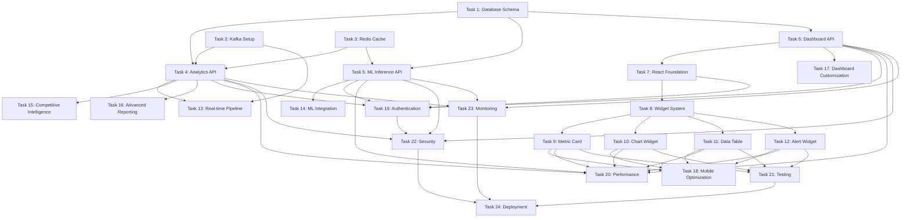

# Analytics Dashboard - Implementation Tasks

**Feature:** analytics-dashboard  
**Version:** 1.0  
**Generated:** 2025-08-04  
**Total Tasks:** 24  
**Estimated Effort:** 8-10 weeks  

## Task Breakdown by Component

### Phase 1: Infrastructure & Core Services (Tasks 1-6)

#### Task 1: Database Schema Setup
**ID:** analytics-dashboard-task-1  
**Priority:** P0 (Critical)  
**Effort:** 2 days  
**Dependencies:** None  

**Description:**
Set up TimescaleDB and PostgreSQL schemas for analytics data storage, including time-series tables, dashboard configurations, and user preferences.

**Acceptance Criteria:**
- ✅ TimescaleDB hypertables created for metrics and sales events
- ✅ PostgreSQL tables created for dashboard configs and user preferences  
- ✅ Proper indexing and partitioning implemented
- ✅ Database migrations working with version control
- ✅ Connection pooling configured with PgBouncer

**Technical Details:**
- Create `metrics`, `sales_events`, `product_metrics` hypertables
- Create `dashboards`, `widgets`, `user_preferences` regular tables
- Set up continuous aggregates for real-time metrics
- Configure retention and compression policies
- Implement database seeding for development

#### Task 2: Kafka Event Streaming Setup
**ID:** analytics-dashboard-task-2  
**Priority:** P0 (Critical)  
**Effort:** 3 days  
**Dependencies:** Task 1  

**Description:**
Configure Apache Kafka for real-time event streaming with topics for raw events, enriched data, and aggregated metrics.

**Acceptance Criteria:**
- ✅ Kafka cluster configured with proper topics
- ✅ Kafka Streams application for data processing
- ✅ Producer/consumer implementations working
- ✅ Schema registry configured for event schemas
- ✅ Monitoring and alerting for Kafka health

**Technical Details:**
- Create topics: `raw-events`, `enriched-events`, `aggregated-metrics`
- Implement stream processing jobs for real-time aggregation
- Set up schema evolution and validation
- Configure replication and fault tolerance
- Implement dead letter queues for error handling

#### Task 3: Redis Caching Layer
**ID:** analytics-dashboard-task-3  
**Priority:** P0 (Critical)  
**Effort:** 1.5 days  
**Dependencies:** None  

**Description:**
Set up Redis cluster for multi-level caching of dashboard data, user sessions, and real-time metrics.

**Acceptance Criteria:**
- ✅ Redis cluster configured with persistence
- ✅ Cache key strategies implemented
- ✅ TTL policies configured for different data types
- ✅ Cache invalidation mechanisms working
- ✅ Connection pooling and failover configured

**Technical Details:**
- Implement cache layers: L1 (app), L2 (Redis), L3 (query cache)
- Configure cache warming for frequently accessed data
- Set up Redis Streams for real-time notifications
- Implement circuit breaker pattern for cache failures
- Configure memory optimization and eviction policies

#### Task 4: Analytics API Service
**ID:** analytics-dashboard-task-4  
**Priority:** P0 (Critical)  
**Effort:** 4 days  
**Dependencies:** Tasks 1, 2, 3  

**Description:**
Develop the core Analytics API service using NestJS with TypeScript for real-time metrics calculation and historical data aggregation.

**Acceptance Criteria:**
- ✅ NestJS service with proper module structure
- ✅ Real-time metrics endpoints implemented
- ✅ Historical analytics endpoints working
- ✅ Event processing integrated with Kafka
- ✅ Caching layer integrated with Redis

**Technical Details:**
- Implement REST endpoints for metrics, trends, and queries
- Create service classes for data aggregation
- Integrate Kafka consumers for real-time processing
- Implement caching strategies for hot data
- Add proper error handling and logging

#### Task 5: ML Inference API Service
**ID:** analytics-dashboard-task-5  
**Priority:** P1 (High)  
**Effort:** 5 days  
**Dependencies:** Tasks 1, 3  

**Description:**
Build Python FastAPI service for machine learning model inference, including revenue forecasting, demand prediction, and price optimization.

**Acceptance Criteria:**
- ✅ FastAPI service with proper project structure
- ✅ Model serving endpoints implemented
- ✅ Feature store integration working
- ✅ Prediction caching implemented
- ✅ Model versioning and deployment pipeline

**Technical Details:**
- Implement prediction endpoints for revenue, demand, pricing
- Create feature engineering pipeline
- Integrate with TensorFlow Serving and PyTorch Serve
- Implement model loading and caching strategies
- Add model performance monitoring

#### Task 6: Dashboard API Service
**ID:** analytics-dashboard-task-6  
**Priority:** P0 (Critical)  
**Effort:** 3 days  
**Dependencies:** Task 1  

**Description:**
Create NestJS GraphQL service for dashboard configuration management, widget customization, and real-time updates.

**Acceptance Criteria:**
- ✅ GraphQL schema defined for dashboards and widgets
- ✅ CRUD operations for dashboard management
- ✅ WebSocket subscriptions for real-time updates
- ✅ User preference management
- ✅ Dashboard sharing and collaboration features

**Technical Details:**
- Implement GraphQL resolvers for dashboard operations
- Create WebSocket handlers for real-time updates
- Implement user preference storage and retrieval
- Add dashboard template system
- Integrate with authentication service

### Phase 2: Frontend Core Components (Tasks 7-12)

#### Task 7: React Dashboard Foundation
**ID:** analytics-dashboard-task-7  
**Priority:** P0 (Critical)  
**Effort:** 2 days  
**Dependencies:** Task 6  

**Description:**
Set up React 18 application foundation with TypeScript, routing, state management, and design system integration.

**Acceptance Criteria:**
- ✅ React 18 with TypeScript configuration
- ✅ Redux Toolkit with RTK Query setup
- ✅ React Router with protected routes
- ✅ Design system components imported
- ✅ Build system with Vite configured

**Technical Details:**
- Configure TypeScript with strict mode
- Set up Redux store with proper slices
- Implement routing with authentication guards
- Configure Tailwind CSS with design tokens
- Set up development and production builds

#### Task 8: Widget System Architecture
**ID:** analytics-dashboard-task-8  
**Priority:** P0 (Critical)  
**Effort:** 3 days  
**Dependencies:** Task 7  

**Description:**
Create the core widget system with drag-and-drop functionality, resizing capabilities, and configuration management.

**Acceptance Criteria:**
- ✅ Widget base component with common functionality
- ✅ Drag-and-drop grid system implementation
- ✅ Widget resizing with grid constraints
- ✅ Widget configuration modal system
- ✅ Widget persistence and loading

**Technical Details:**
- Implement widget base class with lifecycle methods
- Create grid layout system with react-grid-layout
- Implement widget configuration schema validation
- Add widget marketplace for adding new widgets
- Create widget state management with Redux

#### Task 9: Metric Card Widget
**ID:** analytics-dashboard-task-9  
**Priority:** P0 (Critical)  
**Effort:** 2 days  
**Dependencies:** Task 8  

**Description:**
Implement the metric card widget component with real-time updates, trend indicators, and mini chart visualizations.

**Acceptance Criteria:**
- ✅ Metric card with value display and formatting
- ✅ Trend indicators with up/down/neutral states
- ✅ Mini chart integration with trend data
- ✅ Real-time updates via WebSocket
- ✅ Loading and error states handled

**Technical Details:**
- Create reusable metric card component
- Implement number formatting with internationalization
- Add mini chart using lightweight charting library
- Integrate WebSocket for real-time updates
- Add click-through navigation to detailed views

#### Task 10: Chart Widget Component
**ID:** analytics-dashboard-task-10  
**Priority:** P0 (Critical)  
**Effort:** 4 days  
**Dependencies:** Task 8  

**Description:**
Build comprehensive chart widget supporting line, bar, area, and donut charts with interactive features and real-time updates.

**Acceptance Criteria:**
- ✅ Multiple chart types (line, bar, area, donut)
- ✅ Interactive features (zoom, pan, tooltip)
- ✅ Time range selection and filtering
- ✅ Data export functionality
- ✅ Responsive design for mobile devices

**Technical Details:**
- Integrate Chart.js or D3.js for visualization
- Implement chart configuration options
- Add data fetching with React Query
- Create chart interaction handlers
- Implement chart accessibility with ARIA labels

#### Task 11: Data Table Widget
**ID:** analytics-dashboard-task-11  
**Priority:** P1 (High)  
**Effort:** 3 days  
**Dependencies:** Task 8  

**Description:**
Create data table widget with sorting, filtering, search, pagination, and export capabilities for tabular data display.

**Acceptance Criteria:**
- ✅ Table with sorting on all columns
- ✅ Search and filter functionality
- ✅ Pagination with configurable page sizes
- ✅ Data export in CSV, Excel formats
- ✅ Row selection and bulk actions

**Technical Details:**
- Implement virtual scrolling for large datasets
- Create column configuration system
- Add advanced filtering with multiple criteria
- Implement table state persistence
- Add accessibility compliance for screen readers

#### Task 12: Alert/Notification Widget
**ID:** analytics-dashboard-task-12  
**Priority:** P1 (High)  
**Effort:** 2 days  
**Dependencies:** Task 8  

**Description:**
Develop alert and notification widget for displaying actionable insights, recommendations, and system alerts.

**Acceptance Criteria:**
- ✅ Alert display with different severity levels
- ✅ Action buttons for alert responses
- ✅ Alert dismissal and snoozing
- ✅ Real-time alert notifications
- ✅ Alert history and management

**Technical Details:**
- Create alert component with severity styling
- Implement alert action system
- Add notification toast integration
- Create alert filtering and categorization
- Implement alert persistence and state management

### Phase 3: Advanced Features (Tasks 13-18)

#### Task 13: Real-time Data Pipeline
**ID:** analytics-dashboard-task-13  
**Priority:** P0 (Critical)  
**Effort:** 4 days  
**Dependencies:** Tasks 2, 4  

**Description:**
Implement end-to-end real-time data pipeline from Etsy API ingestion through Kafka streaming to dashboard updates.

**Acceptance Criteria:**
- ✅ Etsy API integration with rate limit handling
- ✅ Data ingestion service with error handling
- ✅ Stream processing for real-time aggregation
- ✅ WebSocket broadcasting to connected clients
- ✅ Data quality validation and monitoring

**Technical Details:**
- Create Etsy API client with retry logic
- Implement stream processing jobs with Kafka Streams
- Add data enrichment and validation
- Create WebSocket service for client updates
- Implement monitoring and alerting for pipeline health

#### Task 14: Machine Learning Integration
**ID:** analytics-dashboard-task-14  
**Priority:** P1 (High)  
**Effort:** 5 days  
**Dependencies:** Task 5  

**Description:**
Integrate ML models for revenue forecasting, demand prediction, and pricing optimization with the frontend dashboard.

**Acceptance Criteria:**
- ✅ Revenue forecasting widget with confidence intervals
- ✅ Demand prediction for inventory management
- ✅ Price optimization recommendations
- ✅ Model explainability and confidence scores
- ✅ A/B testing framework for model improvements

**Technical Details:**
- Create ML model client with caching
- Implement prediction result visualization
- Add model confidence and explanation UI
- Create feedback loop for model improvement
- Implement A/B testing for model comparisons

#### Task 15: Competitive Intelligence Dashboard
**ID:** analytics-dashboard-task-15  
**Priority:** P2 (Medium)  
**Effort:** 4 days  
**Dependencies:** Task 4  

**Description:**
Build competitive intelligence features including market positioning, competitor analysis, and trend detection.

**Acceptance Criteria:**
- ✅ Market position visualization
- ✅ Competitor pricing comparison
- ✅ Trend detection and alerts
- ✅ Opportunity identification
- ✅ Market share analysis

**Technical Details:**
- Create competitor data collection service
- Implement market analysis algorithms
- Build competitive visualization components
- Add trend detection with statistical analysis
- Create opportunity scoring and ranking

#### Task 16: Advanced Reporting System
**ID:** analytics-dashboard-task-16  
**Priority:** P2 (Medium)  
**Effort:** 4 days  
**Dependencies:** Tasks 4, 6  

**Description:**
Implement automated report generation, custom report builder, and scheduled report delivery system.

**Acceptance Criteria:**
- ✅ Report template system with customization
- ✅ Automated report scheduling
- ✅ PDF and Excel export capabilities
- ✅ Email delivery with customizable content
- ✅ Report sharing and collaboration

**Technical Details:**
- Create report template engine
- Implement PDF generation with charts
- Add email delivery service integration
- Create report builder UI with drag-and-drop
- Implement report access control and sharing

#### Task 17: Dashboard Customization System
**ID:** analytics-dashboard-task-17  
**Priority:** P1 (High)  
**Effort:** 3 days  
**Dependencies:** Tasks 8, 6  

**Description:**
Build comprehensive dashboard customization features including layout management, widget configuration, and user preferences.

**Acceptance Criteria:**
- ✅ Drag-and-drop dashboard layout editor
- ✅ Widget marketplace with custom widgets
- ✅ Dashboard templates for different user types
- ✅ Import/export dashboard configurations
- ✅ Team dashboard sharing and collaboration

**Technical Details:**
- Implement advanced grid layout system
- Create widget configuration schema system
- Build dashboard template management
- Add dashboard versioning and rollback
- Implement team collaboration features

#### Task 18: Mobile Optimization
**ID:** analytics-dashboard-task-18  
**Priority:** P1 (High)  
**Effort:** 3 days  
**Dependencies:** Tasks 7-12  

**Description:**
Optimize dashboard for mobile devices with responsive design, touch interactions, and mobile-specific features.

**Acceptance Criteria:**
- ✅ Responsive design working on all screen sizes
- ✅ Touch-optimized interactions and gestures
- ✅ Mobile-specific navigation patterns
- ✅ Offline capability for core features
- ✅ Push notifications for mobile alerts

**Technical Details:**
- Implement responsive grid system
- Add touch gesture support
- Create mobile navigation components
- Implement service worker for offline mode
- Add push notification service integration

### Phase 4: Quality & Performance (Tasks 19-24)

#### Task 19: Authentication Integration
**ID:** analytics-dashboard-task-19  
**Priority:** P0 (Critical)  
**Effort:** 2 days  
**Dependencies:** Tasks 4, 6, 7  

**Description:**
Integrate analytics dashboard with existing authentication system including JWT validation, role-based access, and session management.

**Acceptance Criteria:**
- ✅ JWT token validation and refresh
- ✅ Role-based access control for features
- ✅ Session management with Redis
- ✅ Multi-factor authentication support
- ✅ Single sign-on integration

**Technical Details:**
- Implement JWT middleware for API services
- Create RBAC system for dashboard features
- Add session persistence with Redis
- Integrate with existing auth service
- Implement logout and session cleanup

#### Task 20: Performance Optimization
**ID:** analytics-dashboard-task-20  
**Priority:** P1 (High)  
**Effort:** 3 days  
**Dependencies:** Tasks 4-6, 7-12  

**Description:**
Optimize dashboard performance including caching strategies, lazy loading, virtualization, and bundle optimization.

**Acceptance Criteria:**
- ✅ Dashboard loads in under 3 seconds
- ✅ Lazy loading implemented for widgets
- ✅ Virtual scrolling for large datasets
- ✅ Bundle size optimized with code splitting
- ✅ Memory leaks eliminated

**Technical Details:**
- Implement React.memo and useMemo optimizations
- Add code splitting at route and component level
- Create lazy loading system for widgets
- Implement virtual scrolling for tables
- Optimize bundle with Webpack/Vite analysis

#### Task 21: Testing Suite Implementation
**ID:** analytics-dashboard-task-21  
**Priority:** P1 (High)  
**Effort:** 4 days  
**Dependencies:** All frontend tasks  

**Description:**
Implement comprehensive testing suite including unit tests, integration tests, and end-to-end tests for the analytics dashboard.

**Acceptance Criteria:**
- ✅ Unit tests with 90%+ coverage
- ✅ Integration tests for API endpoints
- ✅ End-to-end tests for user workflows
- ✅ Performance tests for scalability
- ✅ Accessibility tests with automated tools

**Technical Details:**
- Create Jest unit tests for all components
- Implement React Testing Library integration tests
- Add Cypress E2E tests for critical workflows
- Create load testing with k6 or Artillery
- Implement accessibility testing with axe-core

#### Task 22: Security Implementation
**ID:** analytics-dashboard-task-22  
**Priority:** P0 (Critical)  
**Effort:** 2 days  
**Dependencies:** Tasks 4-6, 19  

**Description:**
Implement security measures including input validation, SQL injection prevention, XSS protection, and CSRF tokens.

**Acceptance Criteria:**
- ✅ Input validation on all API endpoints
- ✅ SQL injection prevention with parameterized queries
- ✅ XSS protection with content security policy
- ✅ CSRF token validation
- ✅ Rate limiting and DDoS protection

**Technical Details:**
- Implement input validation with Joi/Yup schemas
- Add parameterized queries and ORM safety
- Configure CSP headers and XSS protection
- Implement CSRF token middleware
- Add rate limiting with Redis-based counters

#### Task 23: Monitoring and Observability
**ID:** analytics-dashboard-task-23  
**Priority:** P1 (High)  
**Effort:** 3 days  
**Dependencies:** Tasks 4-6  

**Description:**
Set up comprehensive monitoring, logging, and alerting for the analytics dashboard system.

**Acceptance Criteria:**
- ✅ Application metrics with Prometheus
- ✅ Centralized logging with ELK stack
- ✅ Distributed tracing with Jaeger
- ✅ Business metrics dashboards
- ✅ Alerting rules and notifications

**Technical Details:**
- Implement Prometheus metrics collection
- Configure structured logging with Winston
- Add distributed tracing instrumentation
- Create Grafana dashboards for monitoring
- Set up alerting rules with PagerDuty integration

#### Task 24: Deployment and DevOps
**ID:** analytics-dashboard-task-24  
**Priority:** P0 (Critical)  
**Effort:** 3 days  
**Dependencies:** All previous tasks  

**Description:**
Set up production deployment pipeline with Kubernetes, CI/CD automation, and infrastructure as code.

**Acceptance Criteria:**
- ✅ Kubernetes manifests for all services
- ✅ CI/CD pipeline with GitHub Actions
- ✅ Blue-green deployment strategy
- ✅ Auto-scaling configuration
- ✅ Backup and disaster recovery procedures

**Technical Details:**
- Create Kubernetes deployments and services
- Implement GitOps with ArgoCD
- Configure horizontal pod autoscaling
- Set up database backup and restore procedures
- Implement infrastructure monitoring

## Task Dependencies

## Sprint Planning

### Sprint 1 (2 weeks): Infrastructure Foundation
**Tasks:** 1, 2, 3, 4
**Goal:** Core infrastructure and Analytics API service
**Key Deliverables:** Database schemas, Kafka streaming, Redis caching, Analytics API

### Sprint 2 (2 weeks): ML and Dashboard APIs
**Tasks:** 5, 6, 7
**Goal:** ML inference service and React foundation
**Key Deliverables:** ML API service, Dashboard API, React app setup

### Sprint 3 (2 weeks): Core Widget System
**Tasks:** 8, 9, 10
**Goal:** Widget architecture and primary widgets
**Key Deliverables:** Widget system, Metric cards, Chart widgets

### Sprint 4 (2 weeks): Advanced Widgets and Real-time
**Tasks:** 11, 12, 13
**Goal:** Data tables, alerts, and real-time pipeline
**Key Deliverables:** Table widgets, Alert system, Real-time updates

### Sprint 5 (2 weeks): ML Integration and Intelligence
**Tasks:** 14, 15, 19
**Goal:** ML features and competitive intelligence
**Key Deliverables:** Revenue forecasting, Market analysis, Authentication

### Sprint 6 (2 weeks): Advanced Features
**Tasks:** 16, 17, 18
**Goal:** Reporting, customization, and mobile
**Key Deliverables:** Report system, Dashboard customization, Mobile optimization

### Sprint 7 (2 weeks): Quality and Performance
**Tasks:** 20, 21, 22
**Goal:** Optimization, testing, and security
**Key Deliverables:** Performance optimization, Test suite, Security hardening

### Sprint 8 (2 weeks): Production Readiness
**Tasks:** 23, 24
**Goal:** Monitoring and deployment
**Key Deliverables:** Observability stack, Production deployment

## Risk Mitigation

### High Priority Risks
1. **Etsy API Rate Limits**: Implement intelligent caching and request prioritization
2. **Real-time Performance**: Use CDN, caching, and efficient data structures
3. **ML Model Accuracy**: Continuous model training and A/B testing
4. **Database Scalability**: Implement sharding and read replicas

### Medium Priority Risks
1. **UI Complexity**: Progressive disclosure and user testing
2. **Mobile Performance**: Lazy loading and simplified mobile views
3. **Data Quality**: Validation pipelines and anomaly detection
4. **Team Coordination**: Daily standups and clear task dependencies

## Definition of Done

Each task is considered complete when:
- ✅ All acceptance criteria are met
- ✅ Code passes all automated tests (unit, integration, E2E)
- ✅ Code review completed and approved
- ✅ Documentation updated (API docs, README, comments)
- ✅ Security review passed (if applicable)
- ✅ Performance targets met (if applicable)
- ✅ Accessibility compliance verified (for UI tasks)
- ✅ Deployed to staging environment successfully
- ✅ Product owner acceptance received

## Quality Gates

### Development Quality Gates
- Code coverage >90% for critical components
- No high or critical security vulnerabilities
- Performance benchmarks met for dashboard loading
- Accessibility compliance (WCAG 2.1 AA) for all UI components

### Production Readiness Gates
- Load testing passed for expected traffic
- Security penetration testing completed
- Disaster recovery procedures tested
- Monitoring and alerting fully operational
- Documentation complete and up-to-date

This comprehensive task breakdown provides a clear roadmap for implementing the analytics dashboard with proper dependencies, risk mitigation, and quality assurance measures.