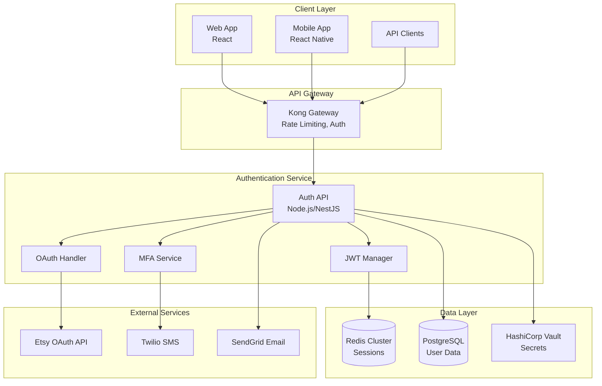
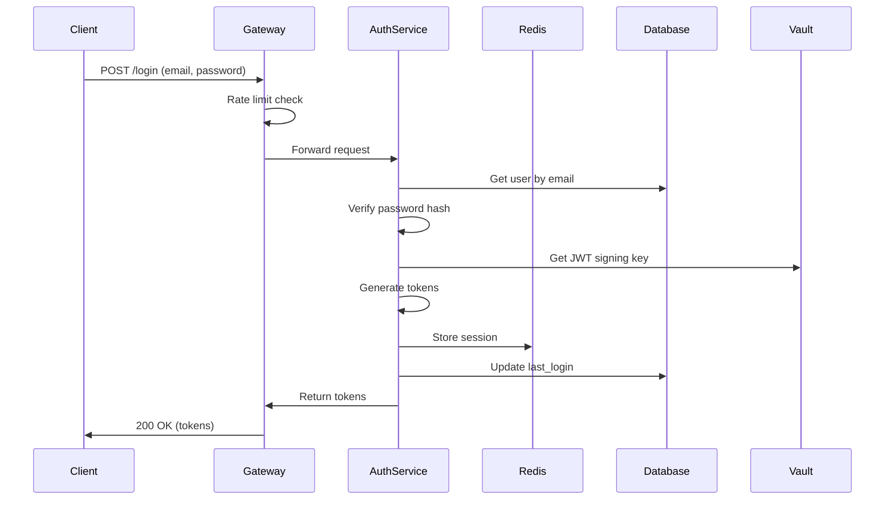

# Technical Design: User Authentication System

**Feature:** user-authentication  
**Version:** 1.0  
**Created:** 2025-08-04  
**Architect:** System

## Executive Summary

This document outlines the technical architecture for EtsyPro AI's authentication system, featuring OAuth2 integration with Etsy, JWT-based session management, multi-factor authentication, and role-based access control. The design prioritizes security, scalability, and developer experience.

## System Architecture

### High-Level Architecture



### Component Architecture

```
auth-service/
├── src/
│   ├── api/
│   │   ├── controllers/
│   │   │   ├── auth.controller.ts
│   │   │   ├── oauth.controller.ts
│   │   │   ├── mfa.controller.ts
│   │   │   └── session.controller.ts
│   │   ├── middlewares/
│   │   │   ├── auth.middleware.ts
│   │   │   ├── rate-limit.middleware.ts
│   │   │   └── validation.middleware.ts
│   │   └── dto/
│   │       ├── auth.dto.ts
│   │       └── user.dto.ts
│   ├── core/
│   │   ├── services/
│   │   │   ├── auth.service.ts
│   │   │   ├── jwt.service.ts
│   │   │   ├── oauth.service.ts
│   │   │   └── mfa.service.ts
│   │   ├── repositories/
│   │   │   ├── user.repository.ts
│   │   │   └── session.repository.ts
│   │   └── entities/
│   │       ├── user.entity.ts
│   │       └── session.entity.ts
│   ├── infrastructure/
│   │   ├── database/
│   │   │   ├── migrations/
│   │   │   └── seeds/
│   │   ├── cache/
│   │   │   └── redis.client.ts
│   │   └── external/
│   │       ├── etsy.client.ts
│   │       ├── twilio.client.ts
│   │       └── sendgrid.client.ts
│   └── shared/
│       ├── constants/
│       ├── exceptions/
│       └── utils/
```

## Technology Stack

### Core Technologies

| Component | Technology | Justification |
|-----------|------------|---------------|
| Runtime | Node.js 20+ | Performance, TypeScript support, ecosystem |
| Framework | NestJS | Enterprise-grade, modular, TypeScript-first |
| Language | TypeScript 5+ | Type safety, developer experience |
| Database | PostgreSQL 15+ | ACID compliance, JSON support, reliability |
| Cache | Redis 7+ | Session storage, fast lookups, pub/sub |
| API Gateway | Kong | Rate limiting, authentication, routing |
| Secrets | HashiCorp Vault | Secure secret management, rotation |

### Security Libraries

| Library | Purpose | Version |
|---------|---------|---------|
| bcrypt | Password hashing | ^5.1.0 |
| jsonwebtoken | JWT generation | ^9.0.0 |
| helmet | Security headers | ^7.0.0 |
| express-rate-limit | Rate limiting | ^7.0.0 |
| joi | Input validation | ^17.9.0 |
| speakeasy | TOTP generation | ^2.0.0 |

### External Services

| Service | Purpose | Integration |
|---------|---------|-------------|
| Etsy API v3 | OAuth2 provider | REST API |
| Twilio | SMS 2FA | SDK |
| SendGrid | Email verification | SDK |
| Datadog | Monitoring | Agent |

## API Design

### Authentication Endpoints

```yaml
openapi: 3.0.0
info:
  title: EtsyPro Authentication API
  version: 1.0.0

paths:
  /api/v1/auth/register:
    post:
      summary: Register new user
      requestBody:
        content:
          application/json:
            schema:
              type: object
              required: [email, password]
              properties:
                email:
                  type: string
                  format: email
                password:
                  type: string
                  minLength: 12
      responses:
        201:
          description: User created
          content:
            application/json:
              schema:
                $ref: '#/components/schemas/AuthResponse'

  /api/v1/auth/login:
    post:
      summary: User login
      requestBody:
        content:
          application/json:
            schema:
              type: object
              required: [email, password]
              properties:
                email:
                  type: string
                password:
                  type: string
                rememberMe:
                  type: boolean
                  default: false
      responses:
        200:
          description: Login successful
          content:
            application/json:
              schema:
                $ref: '#/components/schemas/AuthResponse'

  /api/v1/auth/etsy:
    get:
      summary: Initiate Etsy OAuth
      parameters:
        - name: redirect_uri
          in: query
          schema:
            type: string
      responses:
        302:
          description: Redirect to Etsy

  /api/v1/auth/etsy/callback:
    get:
      summary: Etsy OAuth callback
      parameters:
        - name: code
          in: query
          required: true
          schema:
            type: string
        - name: state
          in: query
          required: true
          schema:
            type: string
      responses:
        302:
          description: Redirect to app

components:
  schemas:
    AuthResponse:
      type: object
      properties:
        user:
          $ref: '#/components/schemas/User'
        tokens:
          type: object
          properties:
            accessToken:
              type: string
            refreshToken:
              type: string
            expiresIn:
              type: integer

    User:
      type: object
      properties:
        id:
          type: string
          format: uuid
        email:
          type: string
        etsyShopId:
          type: string
        roles:
          type: array
          items:
            type: string
        mfaEnabled:
          type: boolean
```

### JWT Token Structure

```json
{
  "header": {
    "alg": "RS256",
    "typ": "JWT",
    "kid": "key-id"
  },
  "payload": {
    "sub": "user-uuid",
    "email": "user@example.com",
    "roles": ["seller"],
    "sessionId": "session-uuid",
    "etsyShopId": "shop-id",
    "iat": 1234567890,
    "exp": 1234568790,
    "iss": "etsypro-ai",
    "aud": "etsypro-client"
  }
}
```

## Database Schema

### Users Table

```sql
CREATE TABLE users (
    id UUID PRIMARY KEY DEFAULT gen_random_uuid(),
    email VARCHAR(255) UNIQUE NOT NULL,
    email_verified BOOLEAN DEFAULT FALSE,
    password_hash VARCHAR(255),
    etsy_user_id VARCHAR(255) UNIQUE,
    etsy_shop_id VARCHAR(255),
    mfa_enabled BOOLEAN DEFAULT FALSE,
    mfa_secret VARCHAR(255),
    mfa_backup_codes JSONB,
    account_status VARCHAR(20) DEFAULT 'active',
    roles TEXT[] DEFAULT ARRAY['seller'],
    metadata JSONB DEFAULT '{}',
    created_at TIMESTAMP WITH TIME ZONE DEFAULT CURRENT_TIMESTAMP,
    updated_at TIMESTAMP WITH TIME ZONE DEFAULT CURRENT_TIMESTAMP,
    last_login_at TIMESTAMP WITH TIME ZONE,
    deleted_at TIMESTAMP WITH TIME ZONE
);

CREATE INDEX idx_users_email ON users(email);
CREATE INDEX idx_users_etsy_shop_id ON users(etsy_shop_id);
CREATE INDEX idx_users_status ON users(account_status) WHERE deleted_at IS NULL;
```

### Sessions Table

```sql
CREATE TABLE sessions (
    id UUID PRIMARY KEY DEFAULT gen_random_uuid(),
    user_id UUID NOT NULL REFERENCES users(id) ON DELETE CASCADE,
    token_family UUID NOT NULL,
    device_id VARCHAR(255),
    ip_address INET,
    user_agent TEXT,
    location JSONB,
    is_active BOOLEAN DEFAULT TRUE,
    created_at TIMESTAMP WITH TIME ZONE DEFAULT CURRENT_TIMESTAMP,
    expires_at TIMESTAMP WITH TIME ZONE NOT NULL,
    revoked_at TIMESTAMP WITH TIME ZONE,
    revoked_reason VARCHAR(255)
);

CREATE INDEX idx_sessions_user_id ON sessions(user_id);
CREATE INDEX idx_sessions_active ON sessions(is_active, expires_at);
CREATE INDEX idx_sessions_token_family ON sessions(token_family);
```

### OAuth Tokens Table

```sql
CREATE TABLE oauth_tokens (
    id UUID PRIMARY KEY DEFAULT gen_random_uuid(),
    user_id UUID NOT NULL REFERENCES users(id) ON DELETE CASCADE,
    provider VARCHAR(50) NOT NULL,
    access_token TEXT NOT NULL,
    refresh_token TEXT,
    expires_at TIMESTAMP WITH TIME ZONE,
    scopes TEXT[],
    provider_user_id VARCHAR(255),
    provider_data JSONB,
    created_at TIMESTAMP WITH TIME ZONE DEFAULT CURRENT_TIMESTAMP,
    updated_at TIMESTAMP WITH TIME ZONE DEFAULT CURRENT_TIMESTAMP
);

CREATE UNIQUE INDEX idx_oauth_tokens_user_provider ON oauth_tokens(user_id, provider);
CREATE INDEX idx_oauth_tokens_expires ON oauth_tokens(expires_at);
```

## Security Architecture

### Authentication Flow



### Security Measures

1. **Password Security**
   - Bcrypt with cost factor 12
   - Password strength validation
   - Password history (last 5)
   - Account lockout after 5 failed attempts

2. **Token Security**
   - JWT with RS256 signing
   - 15-minute access token expiry
   - Refresh token rotation
   - Token family tracking

3. **Session Security**
   - Redis session storage
   - Device fingerprinting
   - Concurrent session limits
   - Session anomaly detection

4. **API Security**
   - Rate limiting (100 req/min default)
   - CORS configuration
   - CSRF protection
   - Input validation
   - SQL injection prevention

5. **Infrastructure Security**
   - TLS 1.3 only
   - Secrets in Vault
   - Database encryption at rest
   - VPC isolation
   - WAF protection

## Performance Optimization

### Caching Strategy

```typescript
// Redis cache structure
interface CacheKeys {
  session: `session:${string}`;           // TTL: 30 min
  user: `user:${string}`;                // TTL: 5 min
  permissions: `permissions:${string}`;   // TTL: 15 min
  mfaAttempts: `mfa:${string}`;         // TTL: 10 min
  rateLimit: `rate:${string}`;          // TTL: 1 min
}
```

### Database Optimization

1. **Connection Pooling**
   ```typescript
   {
     min: 10,
     max: 100,
     idleTimeoutMillis: 30000,
     connectionTimeoutMillis: 2000,
   }
   ```

2. **Query Optimization**
   - Prepared statements for all queries
   - Index usage for email, etsy_shop_id
   - Partial indexes for active users
   - Query result caching

### API Performance

- Response compression (gzip)
- HTTP/2 support
- Connection keep-alive
- CDN for static assets
- Lazy loading for user metadata

## Monitoring & Observability

### Metrics

```typescript
// Key metrics to track
interface AuthMetrics {
  // Performance
  authResponseTime: Histogram;
  tokenGenerationTime: Histogram;
  databaseQueryTime: Histogram;
  
  // Business
  loginAttempts: Counter;
  successfulLogins: Counter;
  failedLogins: Counter;
  mfaAdoption: Gauge;
  
  // Security
  suspiciousLogins: Counter;
  passwordResets: Counter;
  accountLockouts: Counter;
}
```

### Logging

```typescript
// Structured logging format
interface AuthLog {
  timestamp: string;
  level: 'info' | 'warn' | 'error';
  service: 'auth-service';
  userId?: string;
  sessionId?: string;
  action: string;
  metadata: Record<string, any>;
  duration?: number;
  error?: Error;
}
```

### Alerts

1. **Critical Alerts**
   - Auth service down
   - Database connection lost
   - Redis cluster failure
   - High error rate (>5%)

2. **Warning Alerts**
   - Slow response times (>500ms)
   - High memory usage (>80%)
   - Unusual login patterns
   - Token refresh failures

## Deployment Architecture

### Kubernetes Configuration

```yaml
apiVersion: apps/v1
kind: Deployment
metadata:
  name: auth-service
spec:
  replicas: 3
  strategy:
    type: RollingUpdate
    rollingUpdate:
      maxSurge: 1
      maxUnavailable: 0
  template:
    spec:
      containers:
      - name: auth-service
        image: etsypro/auth-service:latest
        ports:
        - containerPort: 3000
        env:
        - name: NODE_ENV
          value: "production"
        resources:
          requests:
            memory: "256Mi"
            cpu: "250m"
          limits:
            memory: "512Mi"
            cpu: "500m"
        livenessProbe:
          httpGet:
            path: /health
            port: 3000
          initialDelaySeconds: 30
          periodSeconds: 10
        readinessProbe:
          httpGet:
            path: /ready
            port: 3000
          initialDelaySeconds: 5
          periodSeconds: 5
```

### Infrastructure Requirements

1. **Compute**
   - 3x t3.medium instances minimum
   - Auto-scaling 3-10 instances
   - Multi-AZ deployment

2. **Database**
   - RDS PostgreSQL db.r6g.large
   - Multi-AZ with read replicas
   - Automated backups

3. **Cache**
   - ElastiCache Redis cluster.cache.r6g.large
   - 3 nodes with replication
   - Automatic failover

4. **Load Balancing**
   - Application Load Balancer
   - SSL termination
   - Health checks

## Migration Strategy

### Phase 1: Core Authentication
1. Deploy basic auth service
2. Implement registration/login
3. Set up database and Redis

### Phase 2: OAuth Integration
1. Integrate Etsy OAuth
2. Token management
3. Shop connection flow

### Phase 3: Enhanced Security
1. Implement 2FA
2. Session management
3. Audit logging

### Phase 4: Scale & Optimize
1. Performance tuning
2. Monitoring setup
3. Load testing

## Risk Mitigation

| Risk | Impact | Mitigation |
|------|--------|------------|
| Etsy API downtime | High | Graceful degradation, cached tokens |
| Token compromise | High | Short expiry, rotation, revocation |
| Brute force attacks | Medium | Rate limiting, CAPTCHA, lockout |
| Session hijacking | High | Device fingerprint, IP validation |
| Database breach | Critical | Encryption, access controls, audit |

## Development Guidelines

### Code Standards
```typescript
// Example service implementation
@Injectable()
export class AuthService {
  constructor(
    private readonly userRepo: UserRepository,
    private readonly jwtService: JwtService,
    private readonly cacheService: CacheService,
  ) {}

  async login(dto: LoginDto): Promise<AuthResponse> {
    // Input validation
    const { email, password } = await validateDto(dto);
    
    // Get user with cache
    const user = await this.getUserByEmail(email);
    
    // Verify password
    if (!await bcrypt.compare(password, user.passwordHash)) {
      throw new UnauthorizedException('Invalid credentials');
    }
    
    // Generate tokens
    const tokens = await this.generateTokens(user);
    
    // Create session
    await this.createSession(user, tokens);
    
    return { user, tokens };
  }
}
```

### Testing Requirements
- Unit tests: 90% coverage
- Integration tests for all endpoints
- Security tests for vulnerabilities
- Load tests for 10K concurrent users
- E2E tests for critical flows

## Next Steps

1. Set up development environment
2. Initialize NestJS project structure
3. Implement core authentication logic
4. Integrate with Etsy OAuth
5. Add 2FA capabilities
6. Deploy to staging environment