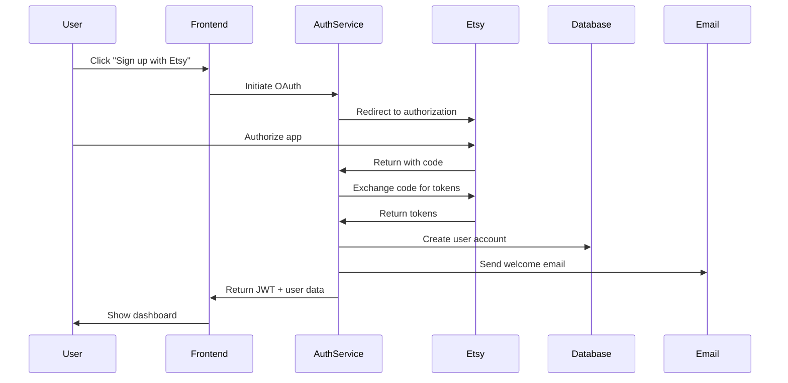
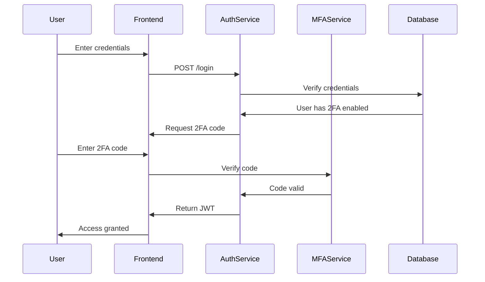

# Requirements Document: User Authentication

**Feature:** user-authentication  
**Version:** 1.0  
**Created:** 2025-08-04  
**Status:** Draft

## Executive Summary

The user authentication system provides secure, multi-factor authentication with Etsy OAuth2 integration. It ensures data protection while maintaining a frictionless user experience across web and mobile platforms.

## Functional Requirements

### FR-001: User Registration

**User Story**: As a new user, I want to register using my Etsy account so that I can quickly access the platform

**Acceptance Criteria**:
- Given I am on the registration page, When I click "Sign up with Etsy", Then I am redirected to Etsy OAuth
- Given I authorize the app on Etsy, When I return to EtsyPro, Then my account is created with Etsy data
- Given I complete Etsy auth, When account is created, Then I receive a welcome email
- Given registration is complete, When I first login, Then I am prompted to set up 2FA

**Business Rules**:
- Email must be verified before full access
- Etsy shop must be active to register
- One account per Etsy shop ID

### FR-002: User Login

**User Story**: As a returning user, I want to login securely and quickly

**Acceptance Criteria**:
- Given I have valid credentials, When I login, Then I access my dashboard within 2 seconds
- Given I enable "Remember Me", When I return within 30 days, Then I am auto-logged in
- Given I fail login 3 times, When I try again, Then I must complete CAPTCHA
- Given I login from new device, When authenticated, Then I receive security alert email

### FR-003: Multi-Factor Authentication

**User Story**: As a security-conscious user, I want to enable 2FA to protect my account

**Acceptance Criteria**:
- Given I am in security settings, When I enable 2FA, Then I can choose SMS, TOTP, or Email
- Given 2FA is enabled, When I login, Then I must provide second factor
- Given I lose 2FA device, When I use backup code, Then I can access account
- Given 2FA fails 3 times, When locked out, Then I can recover via email

**2FA Methods**:
1. SMS: 6-digit code via Twilio
2. TOTP: Google Authenticator compatible
3. Email: 6-digit code with 10-minute expiry

### FR-004: Password Management

**User Story**: As a user, I want to manage my password securely

**Acceptance Criteria**:
- Given I forget password, When I request reset, Then I receive secure reset link
- Given reset link is clicked, When within 1 hour, Then I can set new password
- Given I change password, When successful, Then all sessions are terminated
- Given password is weak, When I set it, Then I see strength indicator and requirements

**Password Requirements**:
- Minimum 12 characters
- Mix of uppercase, lowercase, numbers, symbols
- Not in common password list
- Different from last 5 passwords

### FR-005: OAuth2 Integration

**User Story**: As an Etsy seller, I want seamless integration with my Etsy account

**Acceptance Criteria**:
- Given I connect Etsy, When authorized, Then store access tokens securely
- Given token expires, When API call fails, Then automatically refresh token
- Given Etsy revokes access, When detected, Then notify user to reauthorize
- Given multiple shops, When connecting, Then allow shop selection

### FR-006: Session Management

**User Story**: As a user, I want control over my active sessions

**Acceptance Criteria**:
- Given I view sessions, When listed, Then I see device, location, last active
- Given suspicious session, When I revoke it, Then that session is terminated
- Given inactivity for 30 minutes, When I return, Then I must re-authenticate
- Given I logout, When confirmed, Then session is cleared from all storage

### FR-007: Role-Based Access Control

**User Story**: As an enterprise user, I want to manage team access

**Acceptance Criteria**:
- Given I am admin, When I invite team member, Then they receive email invitation
- Given team member joins, When assigned role, Then they have appropriate permissions
- Given I revoke access, When confirmed, Then user loses all access immediately
- Given role changes, When saved, Then permissions update in real-time

**Roles**:
1. **Owner**: Full access, billing, team management
2. **Admin**: All features except billing
3. **Analyst**: Read-only access to analytics
4. **Operator**: Manage listings and inventory

### FR-008: Mobile Biometric Authentication

**User Story**: As a mobile user, I want to use biometrics for quick access

**Acceptance Criteria**:
- Given device supports biometrics, When enabled, Then I can login with fingerprint/face
- Given biometric fails, When fallback, Then I can use password + 2FA
- Given new device, When setting up, Then biometrics require initial password auth
- Given biometrics disabled, When in settings, Then I can re-enable anytime

## Non-Functional Requirements

### NFR-001: Performance
- Authentication response time < 200ms
- OAuth callback handling < 1 second
- Session validation < 50ms
- Support 10,000 concurrent authentications

### NFR-002: Security
- All passwords bcrypt hashed (cost factor 12)
- JWT tokens with 15-minute expiry
- Refresh tokens rotate on use
- All auth endpoints rate limited
- HTTPS required for all communications
- CSRF protection on all forms

### NFR-003: Availability
- 99.9% uptime for auth services
- Graceful degradation if Etsy OAuth unavailable
- Circuit breaker for external services
- Automated failover for auth database

### NFR-004: Scalability
- Horizontal scaling for auth service
- Redis cluster for session storage
- Database read replicas for auth queries
- CDN for static auth assets

### NFR-005: Compliance
- GDPR compliant data handling
- CCPA privacy requirements
- SOC 2 audit logging
- PCI DSS for future payment handling

## Data Requirements

### User Profile Data
```json
{
  "userId": "uuid",
  "email": "string",
  "emailVerified": "boolean",
  "etsyUserId": "string",
  "etsyShopId": "string",
  "passwordHash": "string",
  "mfaEnabled": "boolean",
  "mfaSecret": "string",
  "roles": ["string"],
  "createdAt": "timestamp",
  "lastLoginAt": "timestamp",
  "accountStatus": "active|suspended|deleted"
}
```

### Session Data
```json
{
  "sessionId": "uuid",
  "userId": "uuid",
  "deviceId": "string",
  "ipAddress": "string",
  "userAgent": "string",
  "createdAt": "timestamp",
  "expiresAt": "timestamp",
  "isActive": "boolean"
}
```

### OAuth Token Data
```json
{
  "userId": "uuid",
  "provider": "etsy",
  "accessToken": "encrypted_string",
  "refreshToken": "encrypted_string",
  "expiresAt": "timestamp",
  "scopes": ["string"],
  "shopId": "string"
}
```

## API Endpoints

### Authentication APIs
- `POST /api/v1/auth/register` - New user registration
- `POST /api/v1/auth/login` - User login
- `POST /api/v1/auth/logout` - User logout
- `POST /api/v1/auth/refresh` - Refresh JWT token
- `POST /api/v1/auth/verify-email` - Email verification
- `POST /api/v1/auth/forgot-password` - Password reset request
- `POST /api/v1/auth/reset-password` - Password reset confirm

### OAuth APIs
- `GET /api/v1/auth/etsy` - Initiate Etsy OAuth
- `GET /api/v1/auth/etsy/callback` - Etsy OAuth callback
- `POST /api/v1/auth/etsy/disconnect` - Revoke Etsy access

### MFA APIs
- `POST /api/v1/auth/mfa/enable` - Enable 2FA
- `POST /api/v1/auth/mfa/verify` - Verify 2FA code
- `POST /api/v1/auth/mfa/disable` - Disable 2FA
- `GET /api/v1/auth/mfa/backup-codes` - Get backup codes

### Session APIs
- `GET /api/v1/auth/sessions` - List active sessions
- `DELETE /api/v1/auth/sessions/:id` - Revoke session
- `DELETE /api/v1/auth/sessions` - Revoke all sessions

## Process Flows

### Registration Flow


### Login with 2FA Flow


## Testing Requirements

### Unit Tests
- Password hashing and verification
- JWT token generation and validation
- OAuth token refresh logic
- Role permission checks

### Integration Tests
- End-to-end registration flow
- Login with various 2FA methods
- Session management operations
- OAuth integration with mock Etsy

### Security Tests
- Penetration testing for auth endpoints
- SQL injection attempts
- XSS vulnerability scanning
- Brute force protection verification

### Performance Tests
- 10,000 concurrent login attempts
- Token validation under load
- Database query optimization
- Redis cluster failover

## 🚦 Routing Recommendation

Based on the requirements analysis:

**Primary Next Agent**: `architect`
- **Why**: Complex OAuth2 integration, JWT implementation, and security architecture needed
- **Focus Areas**: System design for auth service, security architecture, API design
- **Key Decisions Needed**: Token storage strategy, session management approach, microservice boundaries

**Secondary Agents** (can run in parallel):
1. `uiux-designer`: Design login/registration flows, 2FA setup screens, session management UI
2. `database-architect`: Design user, session, and OAuth token schemas with security considerations

**Suggested Command**:
```
Create technical architecture for user authentication system focusing on OAuth2 integration with Etsy, JWT token management, session storage with Redis, and security best practices including 2FA implementation
```