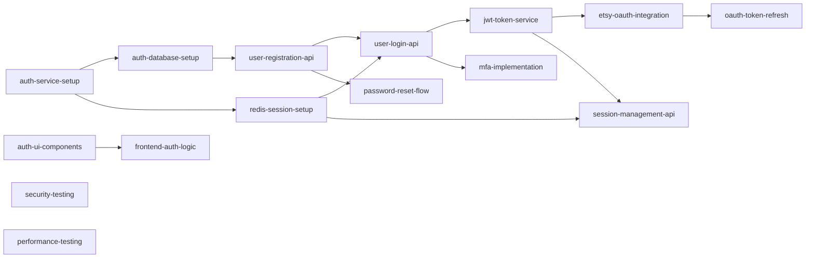

# Implementation Tasks: User Authentication

**Feature:** user-authentication  
**Total Tasks:** 15  
**Estimated Duration:** 10 days

## Task Breakdown

### 🏗️ Infrastructure Setup (Day 1-2)

#### Task 1: Initialize Authentication Service
**ID:** auth-service-setup  
**Status:** completed  
**Assigned to:** developer  
**Duration:** 4 hours

**Description:**
Set up NestJS authentication microservice with TypeScript configuration, folder structure, and base dependencies.

**Acceptance Criteria:**
- [ ] NestJS project initialized with TypeScript
- [ ] Folder structure matches design specification
- [ ] ESLint and Prettier configured
- [ ] Docker setup for local development
- [ ] Health check endpoint working

**Dependencies:** None

---

#### Task 2: Database Schema Implementation
**ID:** auth-database-setup  
**Status:** completed  
**Assigned to:** developer  
**Duration:** 3 hours

**Description:**
Create PostgreSQL database schema for users, sessions, and OAuth tokens with migrations.

**Acceptance Criteria:**
- [ ] Users table created with all fields
- [ ] Sessions table with proper indexes
- [ ] OAuth tokens table with encryption
- [ ] Flyway migrations configured
- [ ] Test data seeders created

**Dependencies:** auth-service-setup

---

#### Task 3: Redis Configuration
**ID:** redis-session-setup  
**Status:** completed  
**Assigned to:** developer  
**Duration:** 2 hours

**Description:**
Set up Redis cluster for session storage with proper configuration and connection pooling.

**Acceptance Criteria:**
- [ ] Redis client configured
- [ ] Connection pooling implemented
- [ ] Session TTL settings configured
- [ ] Pub/sub for session invalidation
- [ ] Health check for Redis

**Dependencies:** auth-service-setup

---

### 🔐 Core Authentication (Day 3-4)

#### Task 4: User Registration Endpoint
**ID:** user-registration-api  
**Status:** completed  
**Assigned to:** developer  
**Duration:** 4 hours

**Description:**
Implement user registration with email/password including validation and password hashing.

**Acceptance Criteria:**
- [ ] POST /api/v1/auth/register endpoint
- [ ] Input validation with Joi
- [ ] Password strength validation
- [ ] Bcrypt hashing (factor 12)
- [ ] Welcome email sent
- [ ] Unit tests with 90% coverage

**Dependencies:** auth-database-setup

---

#### Task 5: Login Implementation
**ID:** user-login-api  
**Status:** completed  
**Assigned to:** developer  
**Duration:** 4 hours

**Description:**
Create login endpoint with JWT token generation and session management.

**Acceptance Criteria:**
- [ ] POST /api/v1/auth/login endpoint
- [ ] Password verification
- [ ] JWT token generation (RS256)
- [ ] Refresh token implementation
- [ ] Session creation in Redis
- [ ] Remember me functionality
- [ ] Unit tests

**Dependencies:** user-registration-api, redis-session-setup

---

#### Task 6: JWT Token Management
**ID:** jwt-token-service  
**Status:** completed  
**Assigned to:** developer  
**Duration:** 3 hours

**Description:**
Implement JWT service for token generation, validation, and refresh with proper security.

**Acceptance Criteria:**
- [ ] Token generation with claims
- [ ] Token validation middleware
- [ ] Refresh token rotation
- [ ] Token family tracking
- [ ] Revocation mechanism
- [ ] Integration with Vault for keys

**Dependencies:** user-login-api

---

### 🔗 OAuth Integration (Day 5-6)

#### Task 7: Etsy OAuth2 Integration
**ID:** etsy-oauth-integration  
**Status:** completed  
**Assigned to:** developer  
**Duration:** 6 hours

**Description:**
Implement Etsy OAuth2 flow for user authentication and shop connection.

**Acceptance Criteria:**
- [ ] OAuth initiation endpoint
- [ ] Callback handler
- [ ] Token exchange implementation
- [ ] Secure token storage
- [ ] Shop data retrieval
- [ ] Error handling for OAuth failures
- [ ] Integration tests

**Dependencies:** jwt-token-service

---

#### Task 8: OAuth Token Refresh
**ID:** oauth-token-refresh  
**Status:** completed  
**Assigned to:** developer  
**Duration:** 3 hours

**Description:**
Implement automatic OAuth token refresh with retry logic and error handling.

**Acceptance Criteria:**
- [ ] Automatic refresh before expiry
- [ ] Retry mechanism with backoff
- [ ] Token encryption in database
- [ ] Refresh failure notifications
- [ ] Circuit breaker pattern

**Dependencies:** etsy-oauth-integration

---

### 🛡️ Security Features (Day 7-8)

#### Task 9: Multi-Factor Authentication
**ID:** mfa-implementation  
**Status:** completed  
**Assigned to:** developer  
**Duration:** 6 hours

**Description:**
Implement 2FA with SMS, TOTP, and email options including backup codes.

**Acceptance Criteria:**
- [ ] TOTP generation (speakeasy)
- [ ] SMS integration (Twilio)
- [ ] Email code generation
- [ ] Backup codes (10 codes)
- [ ] MFA enable/disable endpoints
- [ ] QR code generation for apps
- [ ] Unit and integration tests

**Dependencies:** user-login-api

---

#### Task 10: Password Reset Flow
**ID:** password-reset-flow  
**Status:** completed  
**Assigned to:** developer  
**Duration:** 3 hours

**Description:**
Create secure password reset functionality with email verification.

**Acceptance Criteria:**
- [ ] Forgot password endpoint
- [ ] Secure token generation
- [ ] Email with reset link
- [ ] Reset password endpoint
- [ ] Token expiration (1 hour)
- [ ] Password history check

**Dependencies:** user-registration-api

---

#### Task 11: Session Management
**ID:** session-management-api  
**Status:** completed  
**Assigned to:** developer  
**Duration:** 4 hours

**Description:**
Implement session listing, revocation, and device tracking functionality.

**Acceptance Criteria:**
- [ ] List active sessions endpoint
- [ ] Session revocation endpoint
- [ ] Device fingerprinting
- [ ] Location tracking
- [ ] Concurrent session limits
- [ ] Suspicious activity detection

**Dependencies:** jwt-token-service, redis-session-setup

---

### 🎨 Frontend Implementation (Day 8-9)

#### Task 12: Authentication UI Components
**ID:** auth-ui-components  
**Status:** pending  
**Assigned to:** developer  
**Duration:** 6 hours

**Description:**
Build React components for login, registration, and 2FA flows with responsive design.

**Acceptance Criteria:**
- [ ] Login form component
- [ ] Registration form component
- [ ] 2FA setup wizard
- [ ] Password reset forms
- [ ] Session management UI
- [ ] Responsive design (mobile-first)
- [ ] Component unit tests

**Dependencies:** Design specifications

---

#### Task 13: Frontend Authentication Logic
**ID:** frontend-auth-logic  
**Status:** pending  
**Assigned to:** developer  
**Duration:** 4 hours

**Description:**
Implement frontend authentication state management and API integration.

**Acceptance Criteria:**
- [ ] Redux auth slice
- [ ] API service layer
- [ ] Token storage (secure)
- [ ] Auto-refresh logic
- [ ] Protected route component
- [ ] Error handling
- [ ] Integration tests

**Dependencies:** auth-ui-components

---

### 🧪 Testing & Deployment (Day 9-10)

#### Task 14: Security Testing
**ID:** security-testing  
**Status:** pending  
**Assigned to:** qa-engineer  
**Duration:** 4 hours

**Description:**
Conduct comprehensive security testing including penetration testing and vulnerability scanning.

**Acceptance Criteria:**
- [ ] OWASP Top 10 validation
- [ ] SQL injection tests
- [ ] XSS vulnerability tests
- [ ] Brute force protection
- [ ] Session hijacking tests
- [ ] Security report generated

**Dependencies:** All implementation tasks

---

#### Task 15: Load Testing & Optimization
**ID:** performance-testing  
**Status:** pending  
**Assigned to:** qa-engineer  
**Duration:** 4 hours

**Description:**
Perform load testing and optimize for 10,000 concurrent users.

**Acceptance Criteria:**
- [ ] Load test scenarios created
- [ ] 10K concurrent user test
- [ ] Response time < 200ms
- [ ] Database query optimization
- [ ] Caching strategy validation
- [ ] Performance report

**Dependencies:** All implementation tasks

---

## Task Execution Order

## Resource Allocation

- **Backend Developers:** 2 developers for parallel task execution
- **Frontend Developer:** 1 developer for UI implementation
- **QA Engineer:** 1 engineer for testing phases
- **DevOps Engineer:** Part-time for infrastructure setup

## Risk Mitigation

1. **Etsy API Integration Delays**
   - Mitigation: Use mock Etsy API for development
   - Fallback: Email-only authentication initially

2. **Performance Issues**
   - Mitigation: Early load testing
   - Fallback: Horizontal scaling preparation

3. **Security Vulnerabilities**
   - Mitigation: Security review at each phase
   - Fallback: Feature flags for quick disable

## Definition of Done

Each task is considered complete when:
- [ ] Code is written and follows standards
- [ ] Unit tests pass with >80% coverage
- [ ] Code review approved
- [ ] Documentation updated
- [ ] Integration tests pass
- [ ] Deployed to staging environment

## Next Phase Trigger

Once all tasks are marked complete:
1. Run full integration test suite
2. Conduct security audit
3. Perform user acceptance testing
4. Deploy to production with feature flags
5. Monitor for 24 hours
6. Enable for beta users