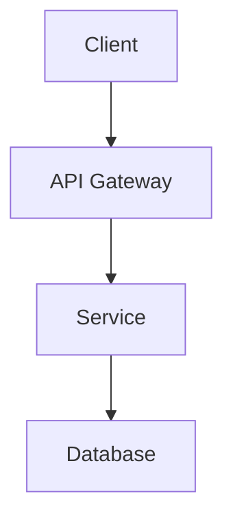

# Design: {FEATURE_NAME}

## Architecture Overview



## Technology Stack
- **Frontend**: {Technology}
- **Backend**: {Technology}
- **Database**: {Technology}
- **Authentication**: {Technology}

## API Design

### Endpoints

#### POST /api/{resource}
**Description**: {What it does}  
**Request Body**:
```json
{
  "field": "value"
}
```
**Response**:
```json
{
  "id": "123",
  "field": "value"
}
```

## Component Design

### {Component Name}
**Purpose**: {What it does}  
**Props**:
- `prop1`: {type} - {description}
- `prop2`: {type} - {description}

**State**:
- `state1`: {type} - {description}

## Database Schema

### Table: {table_name}
| Column | Type | Constraints |
|--------|------|-------------|
| id | UUID | PRIMARY KEY |
| field | VARCHAR(255) | NOT NULL |
| created_at | TIMESTAMP | DEFAULT NOW() |

## Security Considerations
- {Security measure}
- {Security measure}